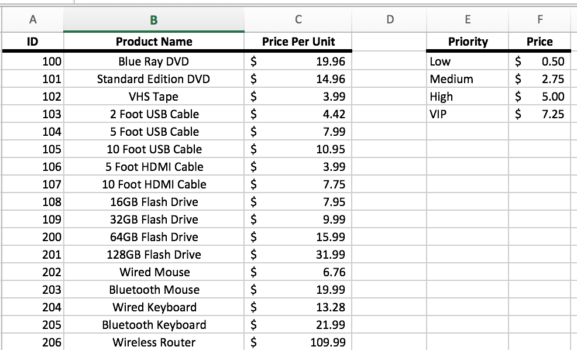

# Unit 1.2 - Egad It's Excel!

## Overview

In this class, students will be introduced to more advanced features in Microsoft Excel such as Pivot Tables, Lookups, and Conditional Formatting.

## Class Objectives

* Students will feel fully proficient in basic Excel navigation and functionality
* Students will gain familiarity with the value of Pivot Tables and the steps for their utilization.
* Students will gain comfort utilizing VLookups and HLookups
* Students will understand how to implement conditional formatting based on logical rules

- - -

# Activities Preview

* **Preclass: Update Excel**
* Check for quick Excel Update. 
  
  * This is more important for Mac users, as a number of key analytics features have been recently ported to the Mac version of Excel.

  
  
* **Excel Playground**
* Reflect on the demos for a moment or two with the person next to you.

* **Gradebook**
* You are tasked with modifying a more complex grade book to determine the letter grades and pass/fail status of a make-believe class.

  * Files/Instructions:

    * [README](Activities/04-Stu_GradeBook/README.md)

    * [04-Stu_GradeBook/GradeBook_Unsolved.xlsx](Activities/04-Stu_GradeBook/Unsolved/GradeBook_Unsolved.xlsx)

    

* **Measuring the Measures**
* The measures of central tendency are a type of **summary statistic** because they can be used to summarize the data set using single values. Whenever we analyze a new data set, we should calculate all three measures of central tendency/.

  * Demonstrate or explain how to manually calculate the mean in Excel.

  * Demonstrate or explain how to manually calculate the median in Excel.

  * Demonstrate or explain how to manually calculate the mode in Excel.

* **Top Songs Pivot Table**
* Pivot tables are exceptionally helpful when dealing with data sets that are large in scale, but contain enough similarities between data points to find commonalities.

  * Files/Instructions:

    * [README](Activities/10-Stu_TopSongsPivot/README.md)

    * [Top5000Songs_Unsolved.xlsx](Activities/10-Stu_TopSongsPivot/Unsolved/Top5000Songs_Unsolved.xlsx)

    

* **Product Pivot**
* A small company selling electronics and electronic media has called upon the class to create a table which visualizes the cost of their recent orders. Using lookups, create a pivot table which serves this purpose.

  * Files/Instructions:

    * [README](Activities/12-Stu_ProductPivot/README.md)

    * [12-Stu_ProductPivot/ProductionPivot_Unsolved.xlsx](Activities/12-Stu_ProductPivot/Unsolved/ProductionPivot_Unsolved.xlsx)

    

- - -

### Copyright

Trilogy Education Services © 2018. All Rights Reserved.
