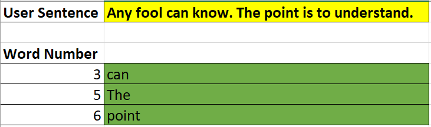

# Unit 2.1 - VBA Vibes

## Overview

In today's class, students will get their first exposure to fundamental programming in the form of Visual Basic for Applications (VBA). Today's class will cover basic concepts like variables, arrays, and conditionals -- and serve as the prelude to their future work in Python and JavaScript.

## Class Objectives

* Students will understand the fundamental building blocks of all programming languages: variables, arrays, conditionals, loops, and functions
* Students will understand how to create simple VBA macros to trigger pop ups and change cell values
* Students will gain practice in writing VBA subroutines that utilize variables and conditionals
* Students will begin to develop their essential coding skills of syntax recollection, pattern recognition, problem decomposition, and debugging

- - -

# Activities Preview

* **Hello VBA**
* This exercise simply required creating three sequential message boxes with text inside each.

  * Files/Instructions:

    * [README](Activities/02-Stu_HelloVBA/README.md)
    
    

    * Instructions:

        * Create and execute a VBA script that generates three pop-up messages with text contained therein.

        * If you finish early, ensure the people around you complete the task as well.

* **Choose Your Button**
* This exercise you will be running a subroutine to trigger two buttons that elicit different messages when clicked.

  * Files/Instructions: 

    * [README](Activities/04-Stu_ChooseYourButton/README.md)
    
    * Instructions:

      * Create an Excel file with two interactive buttons. These buttons should each be associated with a different VBA subroutine. When clicked, each button should trigger a different pop-up message.

      * If you finish early, ensure the people around you complete the task as well.

* **Chess Board**
* This exercise you will be populating a chessboard with chess pieces using a combination of `Cells` and `Ranges`.

  * Files/Instructions:
  
    

  * Instructions:

    * Populate the Chess Board provided with text-based chess pieces. For the top-half of the chess board use Ranges, for the bottom-half of the chess board use Cells.

    * Hint: Remember that with `Ranges`, it is possible to modify multiple cells at once.

* **Total Calculator**
* This exercise, you will create a simple VBA script that takes in user provided Price, Tax, and Quantity values to calculate a total value. You will need to create variables to store these quantities before providing a final output.

  * Files/Instructions:

    * [TotalCalculator_Unsolved.vbs](Activities/08-Stu_TotalCalculator/Unsolved/total_calculator.vbs)

    * [TotalCalculator_Unsolved.xlsm](Activities/08-Stu_TotalCalculator/Unsolved/total_calculator.xlsm)

    * Instructions:

      * Using the Spreadsheet and Unsolved VBS code as a starter, complete the script such that `Price`, `Tax`, `Quantity`, and `Total` are stored in variables.

      * These variables should be then assigned the value of the cell they are associated with in the spreadsheet.

      * When finished, your code should set the `Total` value in the spreadsheet and print a message box with the total in the form of: "Your total is $45.00"

      * Bonus: Try to complete the exercise, _without_ looking at the starter code.

* **Sentence Breaker**
* This exercise, you will be tasked with creating an Excel macro capable of identifying words based on user-provided word numbers. For instance, if a user provides the number 3 for a given sentence of "Any fool can know. The point is to understand", their resulting script should print "can."

  * Files/Instructions:

    * [SentenceBreaker.vbs](Activities/11-Stu_SentenceBreaker/Unsolved/sentence_breaker.vbs)

    * [SentenceBreaker.xlsm](Activities/11-Stu_SentenceBreaker/Unsolved/sentence_breaker.xlsm)

    

    * Instructions:

      * Using the files provided as a starting point, create a VBA script such that it reads in a User Sentence then prints the correct words based on word numbers provided.

      * Notes: This is a more challenging assignment. So take your time on it. Try to bite it off bit by bit.

* **Choose Your Story**
* If time permits, in this exercise, you will be tasked with creating a simple game that outputs a message box based on the user's input number.

  * Files/Instructions:

    * [README](Activities/13-Stu_ChooseYourStory/README.md)

    

    * Instructions:

      * Create a simple Excel workbook and VBA macro in which a user is provided a single button to click. Based on the number they provide in a text box above, a different message box will appear.

        * If the user enters a value of 1, display: "You choose to enter the wooded forest of doom!"

        * If the user enters a value of 2, display: "You choose to enter the fiery volcano of doom!"

        * If the user enters a value of 3, display: "You choose to enter the terrifying jungle of doom!"

        * If the user enters anything else, display: "You decide to stay home instead"

- - -

### Copyright

Trilogy Education Services © 2019. All Rights Reserved.
