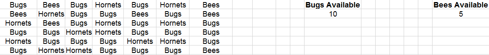

# Unit 2.2 - Vexing VBA

## Overview

In today's class, students will learn to use basic for-loops and nested for-loops in conjunction with conditionals to complete common coding challenges in VBA.

## Class Objectives

* Students will understand the basic syntax of a VBA for loop
* Students will understand how to utilize for-loops in conjunction with conditionals to direct logic flow
* Students will understand the value of a nested for-loop and gain basic proficiency in their use
* Students will refine their fundamental coding skills (syntax recollection, pattern recognition, problem decomposition, and debugging)

- - -

# Activities Preview

* **Warm-up Activity (Budget Checker)**
* This activity involves them creating a script to calculate and correct a price inclusive of fees.

  * Files/Instructions:

    * [BudgetChecker](Activities/01-Stu_Warmup/Unsolved/budget_checker.xlsm)

    * [README](Activities/01-Stu_Warmup/README.md)

    

    * Instructions:

      * Create a VBA Script to complete the budget checker.

      * There are three parts to this problem.

        * Part 1: Calculate the total after fees and enter the value in the "Total" cell.

        * Part II: Create a Message Box to alert the user as to whether the amount including fees is within or over budget.

        * Part III (Challenge): If the total is over budget, correct the price so that it fits within the max of the user's budget. Be sure to round down! (Example: If the user's budget is 100 and the fees are 15%, the max price should 86)

      * Hints:

        * Break up the problem into smaller steps.

        * Look at old code!

        * You got this!

* **Chicken Nugget Loop**
* In this example, you will create a basic VBA script that prints "I will eat `i` Chicken Nuggets," where the value of `i` changes within the for loop.

  * Files/Instructions:

    * [Activities/03-Stu_ChickenNuggets/README.md](Activities/03-Stu_ChickenNuggets/README.md)

    * Instructions:

      * Create a `For` loop that will produce the following example. (Note: The lines signify new cells.)

        | A1         | B1 | C1              |
        |----------|:-------------:|------:|
        | I will eat | 11 | Chicken Nuggets |
        | I will eat | 12 | Chicken Nuggets |
        | I will eat | 13 | Chicken Nuggets |
        | I will eat | 14 | Chicken Nuggets |
        | I will eat | 15 | Chicken Nuggets |
        | I will eat | 16 | Chicken Nuggets |
        | I will eat | 17 | Chicken Nuggets |
        | I will eat | 18 | Chicken Nuggets |
        | I will eat | 19 | Chicken Nuggets |
        | I will eat | 20 | Chicken Nuggets |

      * Bonus: If you finish early, talk to your neighbor about why you may want to use a For loop over the "range" function.

* **Fizz Buzz**
* Fizzbuzz is a very popular logic problem in coding. In this next exercise is a classic problem in technical interviews -- across all programming languages.

  * Files/Instructions:

    * [Activities/05-Stu_FizzBuzz/README.md](Activities/05-Stu_FizzBuzz/README.md)

    * [Activities/05-Stu_FizzBuzz/Unsolved/fizzbuzz.xlsm](Activities/05-Stu_FizzBuzz/Unsolved/fizzbuzz.xlsm)
    
    

    * Instructions:

      * Create a VBA Script that populates the second column with the word "Fizz", "Buzz", or "Fizzbuzz" based on the value in the first column.

      * If the value in column 1 is a multiple of both 3 and 5, print "Fizzbuzz" in column 2.

      * If the value in column 1 is a multiple of just 3, print "Fizz" in column 2.

      * If the value in column 1 is a multiple of just 5, print "Buzz" in column 2.

* **Lotto Search**
* In this exercise, you are given a series of lotto tickets. Your task is to create a VBA script that finds these lotto winners in the list of all ticket purchases. For the bonus, you must additionally find the first instance in which any runner up appears in the list.

  * Files/Instructions:

    * [Activities/06-Stu_Lotto/README.md](Activities/06-Stu_Lotto/README.md)

    * [Activities/06-Stu_Lotto/Unsolved/lotto_numbers.xlsm](Activities/06-Stu_Lotto/Unsolved/lotto_numbers.xlsm)
    
    

    * Instructions:

      * You are in charge of finding our winners for a local lotto drawing.

      * The results are, in order:

        * First: 3957481
        * Second: 5865187
        * Third: 2817729

      * Create a script that will return those lucky winners and print them on the sheet.

        * For each winner include the following pieces of information:

          * First name
          * Last name
          * The winning number

        * They should be placed in winning order of First, Second, Third.

        * There should also be a message box that congratulates the first place winner.

    * Bonus:

      * There may just be one other winner! The below numbers are Wild Lotto Balls. Whichever comes up first in the list will be the fourth place (runner-up) winner. (Note: You must find the _first_ runner up to appear in the list.)

        * 2275339
        * 5868182
        * 1841402

    * Hints:

      * Remember to utilize variables to keep your code clean.

      * For the bonus, you may need to use `Exit For`

* **Hornets Nest**
* This is a fun exercise, but a challenging one. 

  * Files/Instructions:

    * [Activities/08-Stu_HornetsNest/README.md](Activities/08-Stu_HornetsNest/README.md)

    * [Activities/08-Stu_HornetsNest/Unsolved/hornets_nest.xlsm](Activities/08-Stu_HornetsNest/Unsolved/hornets_nest.xlsm)

    

    * Instructions:

      * Create a VBA script to handle the growing Hornet infestation in your spreadsheet.

      * There are three parts to this problem:

        * Part I: Count the number of Hornets found and display the number to your user in the form of a message box.

        * Part II: Modify the script such that it changes the word Hornets to "Bugs".

        * Part III: Modify the script a third time, this time keeping in mind that you have a limited number of Bugs and Bees. Use the full set of Bugs and Bees you have available to replace the Hornets with all available Bugs first then Bees. If you run out of Bugs or Bees provide the user with the message: "Oh no! We still have hornets..."

      * Hints: You may want to create a backup of your spreadsheet as your macro will write over the contents.

- - -

### Copyright

Trilogy Education Services © 2019. All Rights Reserved.
