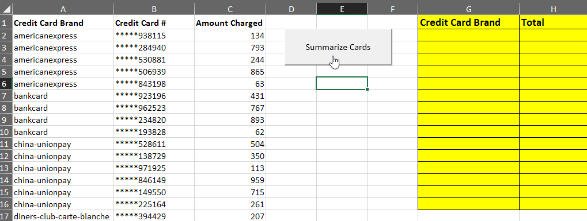

# Unit 2.3 - Getting Real with VBA

## Overview

Today will complete this in-depth week on VBA scripting with VBA Formatting and loops. During the second half of class, there will be a short project for students to work on.

## Class Objectives

* Students will be comfortable formatting spreadsheets using VBA code

* Students will understand how to loop through a table using VBA code and check for changes in values

- - -

# Activities Preview

* **Stars Counter**
* Given an Excel spreadsheet containing 50 rows of "review data" for Spanish and French online language programs. Using your knowledge of VBA, it is up to you to determine the total number of stars each user gave their respective programs and then find the total number of stars both programs received.

  * Files/Instructions:

    * [StarCounter_Unsolved/star_counter.xlsm](Activities/01-Stu_StarsCounter/Unsolved/star_counter.xlsm)

    

    * Instructions:

      * Create a VBA Script that tallies the number of "Full Stars" per row and enters them into the Total column. Starter Code is provided, but feel free to start from scratch if you want an extra challenge :-)

      * Bonus:

        * Instead of hard-coding the last number of the loop, use VBA to determine the last row automatically (i.e. do not use for i = 2 to 51)

        * Create two charts:

          * One to see if there is a relationship between Program Type and Rating (Bar Chart)

          * The other to see if there is a relationship between Date and Rating (Line Graph)

      * Hints:

        * You will need to use a nested for loop.

        * You will need to create a variable to hold the number of stars and continually reset this variable at the start of each row.

* **VBA Grade Book**
* You are going to create an Excel application that checks a fictional student's grade and performs some actions based upon it.

  * Files/Instructions:

    * [GradeBook_Unsolved/grader.xlsm](Activities/03-Stu_Gradebook/Unsolved/grader.xlsm)

    

    * Instructions:

      * Using `grader.xlsm` as a starting point, create a grade calculator using **conditionals**. This calculator will convert a student's numeric grade into a letter grade, and style the resulting cell accordingly.

      * Once complete your script should perform the following:

        * If the score is over 90, the student will receive an "A" in the letter grade cell, and the Pass/Warning/Fail cell will be filled green with the text "Pass."

        * If the score is between 80 and 89 (inclusive), the student will receive a "B" in the letter grade cell, and the Pass/Warning/Fail cell will be filled green with the text "Pass."

        * If the score is between 70 and 79 (inclusive), the student will receive a "C" in the letter grade cell, and the Pass/Warning/Fail cell will be filled yellow with the text "Warning."

        * Finally, if the score is below a 70, the student will receive an "F" in the letter grade cell, and the Pass/Warning/Fail cell will be filled red with the text "Fail."

      * Bonus: Create a second button that resets the grades to the original state and then establishes the previous grade in a row labeled "Last Grade."

* **Checkerboard**
* You will create an 8x8 checkerboard pattern using nothing but VBA scripts. This means creating a script which formats cells based upon whether they are determined to be even or odd. 

  * Files/Instructions:
  
    

    * Instructions:

      * Using VBA scripts, create an 8x8 grid with alternating red and black squares.

      * Hints:

        * You will need to use nested for loops, conditionals, mods, and formatting to create the board.

        * This is a tricky problem! Try to pseudocode a plan first.

        * Unlike previous activities, this activity can be solved in a multitude of different ways. While some methods may be more efficient than others, simply finding a solution to the problem is a great start!

* **Card Checker**
* The primary purpose of this activity is to solidify the necessity of checking for changes in cell values and performing calculations whenever those changes occur. In this next activity, you will be using a VBA script to create a summary table based upon a series of values stored within an Excel spreadsheet.

  * Files/Instructions:

    * [06-Stu_CreditCardChecker/credit_charges.xlsm](Activities/06-Stu_CreditCardChecker/Unsolved/credit_charges.xlsm)

    

    * Instructions:

      * Create a VBA script that will process the credit card purchases, identifying each of the unique brands listed.

      * For the _Basic_ assignment, create a single pop-up message for each of the Credit Card brands listed by looping through the list.

      * For the _Advanced_ assignment, tally the total credit card purchases for each Credit Card brand and add it to the summary table.

* **Wells Fargo**
* This is a two part exercise. In the first part, you will start out by creating a VBA script that loops through each worksheet in our workbook and formats them to be far more readable. It is recommended that you create code that formats a single sheet first and then, once this has been accomplished successfully, modifying the code to loop through and modify each worksheet within the workbook. In the second part of the project, you will be combining all of their previous sheets into one massive table on a new sheet.

  * Files/Instructions:

    * [Activities/07-Stu_WellsFargo_Pt1/combined_wells_fargo.xlsm](Activities/07-Stu_WellsFargo_Pt1/Unsolved/combined_wells_fargo.xlsm)

    * [08-Stu_WellsFargo_Pt2/wells_fargo_format.xlsm](Activities/08-Stu_WellsFargo_Pt2/Unsolved/wells_fargo_format.xlsm)  

    

    * Instructions - Part I:

      1. Extract words before the phrase "\_Wells_Fargo" to figure out which State.

      2. Add the State to the first column of each spreadsheet.

      3. Convert the headers of each row to simply say the year.

      4. Convert the numbers to currency values for all cells

      * Hints:

        * To solve this, we will make use of a [For Each loop](https://docs.microsoft.com/en-us/dotnet/visual-basic/language-reference/statements/for-each-next-statement): in Excel, we can use this to loop over each worksheet in the workbook, no matter how many there are.  The syntax to loop over all worksheets is this:

        ```
          For Each ws In Worksheets
            ' do stuff with the worksheet (ws) '
          Next ws

        ```

        * First work on getting the correct formatting on one sheet before moving onto creating a loop that formats each sheet within your workbook.

        * If you are looking for a useful resource for finding the code to loop through all worksheets in a workbook, check out this link [here](https://support.microsoft.com/en-us/help/142126/macro-to-loop-through-all-worksheets-in-a-workbook)

    * Instructions - Part II:

      1. Loop through every worksheet and select the state contents.

      2. Copy the state contents and paste it into the Combined_Data tab

- - -

### Copyright

Trilogy Education Services © 2019. All Rights Reserved.
