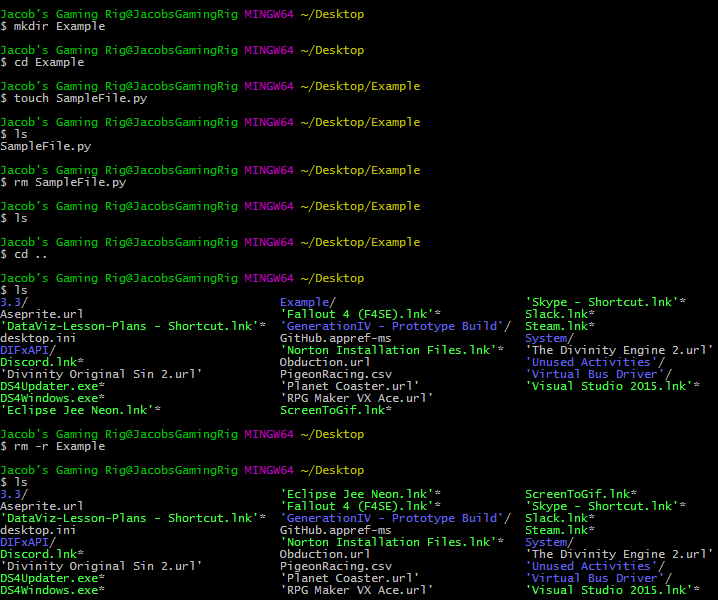

# Unit 3.1 - Let's Begin Python

## Overview

In today's class, students will transition from VBA to the programming language Python. Today's class will check Python installation for students, then cover the basics of terminal navigation, variables, conditionals, and loops.

## Class Objectives

* Students will check Python 3 installation.
* Students will be able to navigate their desktop via the terminal.
* Students will be able to create Python scripts and run them in the terminal.
* Students will be able to understand basic programming concepts in Python.

- - -

# Activities Preview

* **Terminal**
* All of the Python code will be executed through either git-bash or the Mac terminal. Windows users should always use `git-bash` while Mac users should use the `bash` terminal. Students will now dive into the terminal, create three folders, and a pair of Python files which will print some strings of their own creation to the console.

  * Files/Instructions:

    * [CommonCommands.txt](Activities/01-Ins_Terminal/Solved/CommonCommands.txt)

    .

    
    
    * Open up the terminal or git-bash and walk through the following commands:

      * `cd` (Changes the directory).

      * `cd ~` (Changes to the home directory).

      * `cd ..` (Moves up one directory).

      * `ls` (Lists files in the folder).

      * `pwd` (Shows the current directory).

      * `mkdir <FOLDERNAME>` (Creates a new directory with the FOLDERNAME).

      * `touch <FILENAME>` (Creates a new file with the FILENAME).

      * `rm <FILENAME>` (Deletes a file).

      * `rm -r <FOLDERNAME>` (Deletes a folder, make sure to note the -r).

      * `open .` (Opens the current folder on Macs).

      * `explorer .` (Opens the current folder on GitBash).

      * `open <FILENAME>` (Opens a specific file on Macs).

      * `explorer <FILENAME>` (Opens a specific file on GitBash).

    * This is basic terminal navigation, from here you can edit Python files and run in terminal.

      * Create and navigate into a `PythonStuff` folder on the desktop.

      * Create and open `first_file.py` using the text editor.

      * Add `print("This is my first Python file")` and save the code.

      * Return to the terminal and run the file using `python first_file.py`.

      * Explain that `python <FILENAME>.py` tells the computer that this is a python file and to run the code contained within.

      * Repeat again with `second_file.py` using the code `print("This is my second python file")`.

    * Follow along with these instructions in your terminal and write the commands below:

      * Create a folder called `LearnPython`.

      * Navigate into the folder.

      * Inside `LearnPython` create another folder called `Assignment1`.

      * Inside `Assignment1` create a file called `quick_python.py`.

      * Add a print statement to `quick_python.py`.

      * Run `quick_python.py`.

      * Return to the `LearnPython` folder.

      * Inside `LearnPython` create another folder called `Assignment2`.

      * Inside `Assignment2` create a file called `quick_python2.py`.

      * Add a different print statement to `quick_python2.py`.

      * Run `quick_python2.py`.

* **Check Anaconda installation**
* A quick check to ensure you have conda installed `conda` and added to your path.

  * Open up the console and follow along:

    * Enter `conda --version` which will display the version of Anaconda install.

      

* **Hello Variable World!**
* It is now time to create a simple Python application that uses variables. It will both run calculations on integers and print strings out to the console.

  * Files/Instructions:
  
    

    * Instructions:

      * Create two variables called `name` and `country` that will hold strings.

      * Create two variables called `age` and `hourly_wage` that will hold integers.

      * Create a variable called `satisfied` which will hold a boolean.

      * Create a variable called `daily_wage` that will hold the value of `hourly_wage` multiplied by 8.

      * Print out statements using all of the above variables to the console.

* **Down To Input**
* This exercise will give you a chance to work on storing inputs from the command line and run some code based upon the values entered.

  * Files/Instructions:
      
    

    * Instructions:

      * Create two different variables that will take the input of your first name and your neighbor's first name.

      * Create two more inputs that will ask how many months each of you has been coding.

      * Finally, display a result with both your names and the total amount of months coding.

* **Conditional Conundrum**
* During this activity, you will be looking through some pre-written conditionals and attempting to figure out what lines will be printed to the console.

  * Files/Instructions:

    * [conditionals_unsolved.py](Activities/08-Stu_ConditionalConundrum/Unsolved/conditionals_unsolved.py)

    * Instructions:

      * Look through the conditionals within the provided code and figure out which lines will be printed to the console.

      * Do not run the application at first, see if you can follow the thought process for each chunk of code and then place a guess. Only after coming up with a guess for each section should you run the application.

      * Bonus: After figuring out the output for all of the code chunks, create your own series of conditionals to test your fellow students. Once you have completed your puzzle, slack it out to everyone so they can test it.

* **Rock, Paper, Scissors**
* During this time, you will be creating a simple game of Rock, Paper, Scissors that will run within the console.

  * Files/Instructions:

    * [RPS_Unsolved.py](Activities/10-Stu_RockPaperScissors/Unsolved/RPS_Unsolved.py)

    

    * Instructions:

      * Using the terminal, take an input of `r`, `p` or `s` which will stand for rock, paper, and scissors.

      * Have the computer randomly pick one of these three choices.

      * Compare the user's input to the computer's choice to determine if the user won, lost, or tied.

      * Hints: Look into this [stackoverflow](https://stackoverflow.com/questions/306400/how-to-randomly-select-an-item-from-a-list) question for help on using the `random` module to select a value from a list.

* **Number Chain**
* Next up is a number chain exercise that will take user input and print out a string of numbers.

  * Files/Instructions:
  
    

    * Instructions:

      * Using a `while` loop, ask the user "How many numbers?", and then print out a chain of ascending numbers from 0 to the number input.

      * After the results have printed, ask the user if they would like to continue. If "y" is entered, keep the chain running by inputting a new number and starting a new count from 0 to the number input. If "n" is entered, exit the application.

      * Bonus: Rather than just displaying numbers starting at 0, have the numbers begin at the end of the previous chain.

- - -

### Copyright

Trilogy Education Services © 2019. All Rights Reserved.
