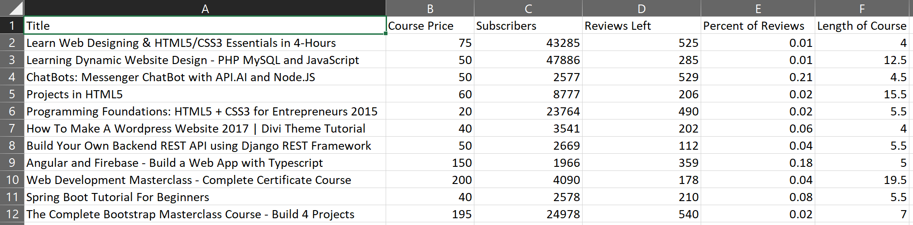

# Unit 3.2 - Reading, Writing, and Pyrithmetic

## Overview

During today's class, the class will be diving further into reading and writing data from/to external CSV files. They will also dive into Python dictionaries, zipping lists, and functions.

## Class Objectives

* Students should feel confident reading data into Python from CSV files.

* Students should feel confident writing data from Python into CSV files.

* Students should know how to zip two lists together and know when this is helpful.

* Students should understand well how to create and use Python functions.

- - -

# Activities Preview

* **Python Check-Up**
* Since last class introduced quite a lot of new material, start with a quick warmup activity to get the Python juices flowing!

  * Files/Instructions:

    * [01-Stu_QuickCheckup/quick_check_up.py](Activities/01-Stu_QuickCheckup/Unsolved/quick_check_up.py)

    

    * Instructions:

      * Create a simple Python command line application. Upon running, the application should:

        * Print "Hello User!"

        * Then ask: "What is your name? "

        * Then respond: "Hello <user's name>"

        * Then ask: "What is your age? "

        * Then respond: "Awww... you're just a baby!" or "Ah... A well traveled soul are ye." depending on the user's age.

      * Hints: Remember to cast your variables!

* **Kid in a Candy Store**
* Each student is being placed in the role of a kid going with their parents to the supermarket. After pestering their parents for a while, they finally are allowed to pick out some candy to take home.

  * Files/Instructions:

    * [KidInCandyStore_Unsolved.py](Activities/03-Stu_KidInCandyStore/Unsolved/kid_in_candy_store.py)

    

  * Instructions:

    * Create a loop that prints all of the candies in the store to the terminal with their index stored in brackets beside them.

      * For example: `"[0] Snickers"`

    * Create a loop that runs for a number of times as determined by the variable `allowance`.

      * For example: If allowance is equal to five, the loop should run five times.

    * Each time this second loop runs, take in a user's input - preferably a number - and then add the candy with a matching index to the variable `candy_cart`.

      * For example: If the user enters "0" as their input, "Snickers" should be added into the `candy_cart` list.

    * Use another loop to print all of the candies selected to the terminal.

    * Bonus: Create a version of the same code which allows a user to select as much candy as they want up until they say they do not want any more.

* **House of Pies**
* In this activity, the class will be constructing an order form that will display a list of pies and then prompt users to make a selection. It will continue to prompt for selections until the user decides to terminate the process. This activity comes in three parts: an easy version that is very much like the previous activity and a hard version which is very challenging.

  * Files/Instructions:
      
    

    * Instructions:

      * **Part 1**

        * Create an order form that will display a list of pies to the user in the following way:

        ```
        Welcome to the House of Pies! Here are our pies:

        ---------------------------------------------------------------------
        (1) Pecan, (2) Apple Crisp, (3) Bean, (4) Banoffee,  (5) Black Bun, (6) Blueberry, (7) Buko, (8) Burek,  (9) Tamale, (10) Steak
        ```

        * Then prompt the user to select which pie they'd like to order via number.

        * Immediately after, follow the order with `Great! We'll have that <PIE NAME> right out for you` and then ask if they would like to make another order. If so, repeat the process.

        * Once the user is done purchasing pies, print the total number of pies ordered.

      * **Part 2 (Very Challenging!)**

        * Modify the application once again, this time conclude the user's purchases by listing out the total pie count broken by _each_ pie.

        ```
        You purchased:
        0 Pecan
        0 Apple Crisp
        0 Bean
        2 Banoffee
        0 Black Bun
        0 Blueberry
        0 Buko
        0 Burek
        0 Tamale
        1 Steak
        ```

* **Module Playground**
* There are tons of built-in modules for Python and there is no possible way that a single class could cover all of them. For the time being, however, look through some of Python's modules and play around with them.

  * Link: [List of Built-In Python Modules](https://docs.python.org/3/py-modindex.html)

* **Reading Netflix**
* In this activity, you will be provided with a CSV file containing data taken from Netflix. You will then create an application which searches through the data for a specific movie/show and returns the name, rating, and review score for it.

  * Files/Instructions:

    * [Netflix_Ratings.csv](Activities/09-Stu_ReadNetFlix/Resources/netflix_ratings.csv)

    

    * Instructions:

      * Prompt the user for what video they are looking for.

      * Search through the `netflix_ratings.csv` to find the user's video.

      * If the CSV contains the user's video then print out the title, what it is rated and the current user ratings.

        * For example: `'Grease is rated PG with a rating of 86'`

      * Bonus:

        * Insert a `break` statement into the for loop to stop the loop when the first movie is found to stop duplicated results. See the [documentation](https://docs.python.org/3.6/reference/simple_stmts.html#break) for additional info.

        * If the CSV does not contain the user's video then print out a message telling them that their video could not be found.

* **Udemy Zip**
* You will now take a large dataset from Udemy, clean it up, and create a new CSV file that is far easier to comprehend.

  * Files/Instructions:

    * [WebDevelopment.csv](Activities/12-Stu_UdemyZip/Resources/web_starter.csv)

    

    * Instructions:

      * Create a Python application that reads the data on Udemy Web Development offerings.

      * Then store the contents of the Title, Price, Subscriber Count, Number of Reviews, and Course Length into Python Lists.

      * Then zip these lists together into a single tuple.

      * Finally, write the contents of your extracted data into a CSV. Make sure to include the titles of these columns in your CSV.

      * Notes: As, with many datasets, the file does not include the header line. Use the below as a guide on the columns: "id,title,url,isPaid,price,numSubscribers,numReviews,numPublishedLectures,instructionalLevel,contentInfo,publishedTime"

      * Bonus:

        * Find the percent of subscribers that have also left a review on the course. Include this in your final output.

        * Parse the string associated with course length, such that we store it as an integer instead of a string. (i.e. "4 hours" should be converted to 4).

- - -

### Copyright

Trilogy Education Services © 2019. All Rights Reserved.
