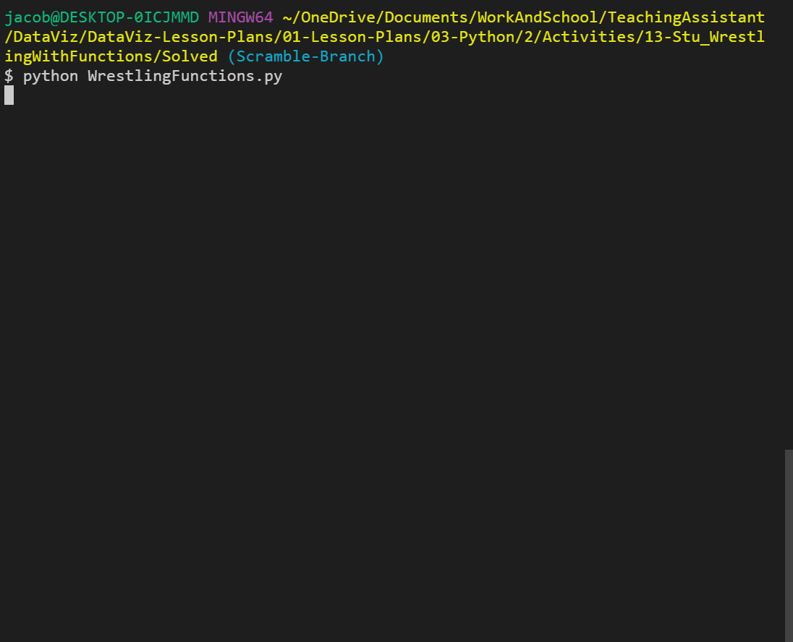
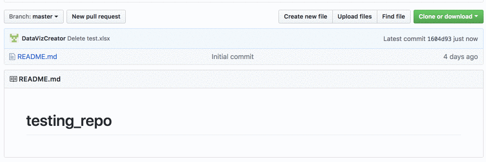
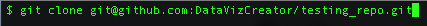

# Unit 3.3 - Python Deeper Dive

## Overview

Today's class will dive deeper into some of Python's other capabilities that will be used throughout the rest of the course. The class will end with students learning Git from the command line.

## Class Objectives

* Students will be able to add, commit, and push code up to GitHub from the command line.

* Students will be able to create and use Python dictionaries.

* Students will be able to read data in from a dictionary.

* Students will be able to use list comprehensions.

* Students will be able to write and re use Python function.

* Students will have a firm understanding of coding logic and reasoning.

- - -

# Activities Preview

* **Cereal Cleaner**
* You will be creating an application that reads in cereal data from a CSV and then prints only those cereals that have more than 5 grams of fiber in them.

  * Files/Instructions:

    * [cereal.csv](Activities/01-Stu_CerealCleaner/Resources/cereal.csv)

    * [cereal_bonus.csv](Activities/01-Stu_CerealCleaner/Resources/cereal_bonus.csv)

    

    * Instructions:

      * Read through `cereal.csv` and find the cereals that contain five grams of fiber or more, printing the data from those rows to the terminal.

      * Hint:

        * Every value within the csv is stored as a string and certain values have a decimal. This means that they will have to be cast to be used.

        * `csv.reader` begins reading the csv file at the first row. Explain that `next(csv_reader, None)` will skip the header row.

        * Integers are whole numbers and, as such, cannot contain decimals. Decimal numbers will have to be cast as a `float` or `double`.

      * Bonus: Try the following again but this time using `cereal_bonus.csv`, which does not include a header.

* **Hobby-Book**
* You will get practice with creating and accessing their own dictionaries based upon their hobbies.

  * Files/Instructions:

    

    * Create a dictionary that will store the following:

      * Your name
      * Your age
      * A list of a few of your hobbies
      * A dictionary of a few days and the time you wake up on those days

    * Print out your name, how many hobbies you have and a time you get up during the week.

* **List Comprehensions**
* In this activity, you will use list comprehensions to compose a wedding invitation to send to every name on your mailing list.

  * Instructions:

    * Open the file called `comprehensions.py`.

    * Create a list that prompts the user for the names of five people they know.

    * Run the provided program. Note that nothing forces you to write the name "properly"—e.g., as "Jane" instead of "jAnE". You will use list comprehensions to fix this.

      * First, use list comprehensions to create a new list that contains the lowercase version of each of the names your user provided.

      * Then, use list comprehensions to create a new list that contains the title-cased versions of each of the names in your lower-cased list.

    * Bonuses: Instead of creating a lower-cased list and _then_ a title-cased list, create the title-cased list in a single comprehension.

    * Hints: See the documentation for the [title](https://docs.python.org/3/library/stdtypes.html#str.title) method.


* **Functions**
* Files/Instructions:

  * [Unsolved/main.py](Activities/07-Stu_Functions/Unsolved/main.py)

  * Instructions:

    * Write a function called `average` that accepts a list of numbers as a single argument.

      * The function `average` should return the arithmetic [mean](https://en.wikipedia.org/wiki/Arithmetic_mean) (average) for a list of numbers.

    * Test your function by calling it with different values and printing the results.

    * Hints: [Arithmetic Mean (Average)](https://en.wikipedia.org/wiki/Arithmetic_mean)

* **Wrestling With Functions**
* Within the world of wrestling, there are winners and there are losers. Winners are labeled as "Superstars" while the losers receive the lowly title of "Jobber". Using a function, create the code necessary to search through a list of wrestlers, determine their win, loss, and draw percentages.

  * Files/Instructions:

    * [08-Par_WrestlingWithFunctions/wrestling_functions.py](Activities/08-Par_WrestlingWithFunctions/Unsolved/wrestling_functions.py)

    * [WWE-Data-2016.csv](Activities/08-Par_WrestlingWithFunctions/Resources/WWE-Data-2016.csv)

    

    * Instructions:

      * Analyze the code and CSV provided, looking specifically for what needs to still be added to the application.

        * Explain that `header = next(reader)` will read the header row from the csv file.

      * Using the starter code provided, create a function called `print_percentages` which takes in a parameter called `wrestler_data` and does the following:

        * Uses the data stored within `wrestler_data` to calculate the percentage of matches the wrestler won, lost, and drew over the course of a year.

        * Prints out the stats for the wrestler to the terminal.

      * Bonus: Still within the `print_percentages()` function, create a conditional that checks a wrestler's loss percentage and prints either "Jobber" to the screen if the number was greater than fifty or "Superstar" if the number was less than 50.

* **Adding Files from the Command Line**
* Follow along with creating a repo and adding files with Terminal/git-bash.

  * Create a new repo.

  * From repo page, click the green box in the top right "Clone or download", select "Use SSH" and copy the link to the clipboard.

  

  * Open terminal (or git-bash for Windows users) and navigate to the home folder using `cd ~`.

  * Type in `git clone <repository link>` in the terminal to clone the repo to the current directory. Once this has run, everyone should now see a folder with the same name as the repo.

    

  * Open the folder in VS Code and create two python script files named `script01.py` and `script02.py`.

  * Once the files have been created, open up Terminal/git-bash and navigate to the repo folder. Run the following lines and explain each as you go through them.

  ```bash
  # Displays that status of files in the folder
  git status

  # Adds all the files into a staging area
  git add .

  # Check that thr files were added correctly
  git status

  # Commits all the files to your repo and adds a message
  git commit -m <add commit message here>

  # Pushes the changes up to GitHub
  git push origin master
  ```

  * Finally navigate to the repo on [Github.com](https://github.com/) to see that the changes have been pushed up.

* **Adding more to the repo**
* Instructions:

  * Using the repo that just created, make or add the following changes:

    * Add new lines of code to one of the python files.
    * Create a new folder.
    * Add a file to the newly created folder.
    * Add, commit and push the changes.
    * Delete the new folder.
    * Add, commit and push the changes again.

- - -

### Copyright

Trilogy Education Services © 2019. All Rights Reserved.
