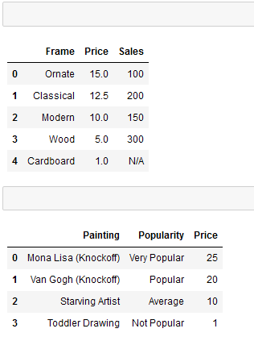

# Unit 4.1 - Introduction to Pandas & Jupyter

## Overview

Today's lesson will introduce students to Jupyter Notebook and the basics of the Pandas module.

### Class Objectives

* Students will be able to serve Jupyter notebook files from local directories and connect to their development environment
* Students will be able to create Pandas DataFrames from scratch
* Students will understand how to run functions on Pandas DataFrames
* Students will know how to read/write DataFrames from/to CSV files using Pandas

- - -

# Activities Preview

* **Netflix Remix**
* For this activity, you will be creating a Jupyter Notebook that performs the same functions as the Netflix activity from last week. While the actual code for this activity may not take you terribly long to craft, expect there to be some time spent bugfixing Jupyter Notebook. By the end of this activity, everyone in class should be able to open Jupyter Notebook, create a new `ipynb` file, and connect to their `PythonData` kernel.

  * Files/Instructions:

    * [Netflix.py](Activities/02-Stu_NetflixRemix/Unsolved/Netflix.py)

    * [Netflix_Ratings.csv](Activities/02-Stu_NetflixRemix/Unsolved/Resources/netflix_ratings.csv)

    

    * Using `Netflix.py` as a jumping off point, convert the application so that it runs properly within a Jupyter Notebook.

    * Make sure to have the application print out the user's input, the path to `Netflix_Ratings.csv`, and the final rating/review for the film in different cells.

    * Bonus: Go through any of the activities from last week and attempt to convert them to run within a Jupyter Notebook. While doing this, try to split up the code into cells and print out the outputs.

    * Hints: If your development environment does not appear as a potential kernel within Jupyter Notebook, close out of Jupyter Notebook and run `conda install -c anaconda nb_conda_kernels` within the terminal. Upon reloading Jupyter Notebook, all possible kernels should now appear.

* **Data-Frame Shop**
* You will now try their hand at creating DataFrames from scratch using the two methods discussed earlier. This will also provide you with the opportunity to better understand what DataFrames look like.

  * Files/Instructions:

    * [04-Stu_DataFrameShop](Activities/04-Stu_DataFrameShop/Unsolved/DataFrameShop.ipynb)

    

    * Create a DataFrame for a frame shop that contains three columns - "Frame", "Price", and "Sales" - and has five rows of data stored within it.

    * Using an alternate method from that used before, create a DataFrame for an art gallery that contains three columns - "Painting", "Price", and "Popularity" - and has four rows of data stored within it.

    * Bonus: Once both of the DataFrames have been created, discuss with those around you which method you prefer to use and why.

* **Training Grounds**
* You will now take a large DataFrame consisting of 200 rows, analyze it using some data functions, and then add a new column into it.

  * Files/Instructions:

    * [TrainingGrounds.ipynb](Activities/06-Stu_TrainingGrounds/Unsolved/TrainingGrounds.ipynb)

    

    * Using the DataFrame provided, perform all of the following actions...

    * Provide a simple, analytical overview of the dataset's numeric columns

    * Collect all of the names of the trainers within the dataset

    * Figure out how many students each trainer has

    * Find the average weight of the students at the gym

    * Find the combined weight of all of the students at the gym

    * Convert the "Membership (Days)" column into weeks and then add this new series into the DataFrame

* **Hey Arnold!**
* For this activity, you will be taking a pre-made DataFrame of "Hey Arnold!" characters and reorganizing it so that it is more understandable and organized.

  * Files/Instructions:

    * [hey_arnold.ipynb](Activities/08-Stu_Hey_Arnold/Unsolved/hey_arnold.ipynb)

    

    * First, use Pandas to create a DataFrame with the following columns and values:

      * `Character_in_show`: Arnold, Gerald, Helga, Phoebe, Harold, Eugene

      * `color_of_hair`: blonde, black, blonde, black, unknown, red

      * `Height`: average, tallish, tallish, short, tall, short

      * `Football_Shaped_Head`: True, False, False, False, False, False

    * You'll note that the above column names are inconsistent and difficult to work with. Rename them to the following, respectively:

      * `Character`, `Hair Color`, `Height`, `Football Head`

    * Next, create a new table that contains all of the columns in the following order...

      * `Character`, `Football Head`, `Hair Color`, `Height`

* **GoodReads**
* You will now take a large CSV of books, read it into Jupyter Notebook using Pandas, clean up the columns, and then write their modified DataFrame to a new CSV file.  You will then take the modified version of the GoodReads DataFrame and create a new Summary DataFrame based upon that dataset using some of Pandas' built-in data functions.

  * Files/Instructions:

    * [GoodReads.ipynb](Activities/10-Stu_GoodReads/Unsolved/GoodReads.ipynb)

    * [books.csv](Activities/10-Stu_GoodReads/Unsolved/Resources/books.csv)

    

    * [GoodReadsSummary.ipynb](Activities/11-Stu_GoodReadsSummary/Unsolved/GoodReadsSummary.ipynb)

    * [books_clean.csv](Activities/11-Stu_GoodReadsSummary/Unsolved/Resources/books_clean.csv)

    

    * Read in the GoodReads CSV using Pandas

    * Remove unnecessary columns from the DataFrame so that only the following columns remain: `isbn`, `original_publication_year`, `original_title`, `authors`, `ratings_1`, `ratings_2`, `ratings_3`, `ratings_4`, and `ratings_5`

    * Rename the columns to the following: `ISBN`, `Publication Year`, `Original Title`, `Authors`, `One Star Reviews`, `Two Star Reviews`, `Three Star Reviews`, `Four Star Reviews`, and `Five Star Reviews`

    * Write the DataFrame into a new CSV file

    * Hints: The base CSV file uses UTF-8 encoding. Trying to read in the file using some other kind of encoding could lead to strange characters appearing within the dataset.

    * Using the modified DataFrame that was created earlier, create a summary table for the dataset that includes the following pieces of information...

    * The count of unique authors within the DataFrame

    * The year of the earliest published book in the DataFrame

    * The year of the latest published book in the DataFrame

    * The total number of reviews within the DataFrame

- - -

### Copyright

Trilogy Education Services © 2019. All Rights Reserved.
