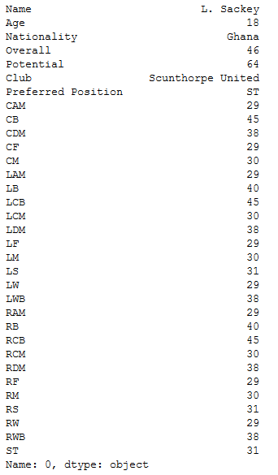

# Unit 4.2 - Exploring Pandas

## Overview

Today's lesson takes dives deeply into Pandas and covers some of the library's more complex functions - like iloc, loc, and grouping - whilst solidifying the concepts from the last class.

## Class Objectives

* Students will understand how to navigate through DataFrames using Loc and Iloc
* Students will understand how to filter and slice Pandas DataFrames
* Students will understand how to create and access Pandas GroupBy objects
* Students will understand how to sort DataFrames
  
- - -

# Activities Preview

* **Good Movies**
* Now that we've covered exploring/filtering DataFrames using `loc[]` and `iloc[]`, you will now create an application that looks through IMDB data in order to find only the best movies out there.

  * Files/Instructions:

    * [goodMovies_unsolved.ipynb](Activities/02-Stu_GoodMovies/Unsolved/goodMovies.ipynb)

    * [movie_scores.csv](Activities/02-Stu_GoodMovies/Unsolved/Resources/movie_scores.csv)

    

    * Use Pandas to load and display the CSV provided in `Resources`.

    * List all the columns in the data set.

    * We're only interested in IMDb data, so create a new table that takes the Film and all the columns relating to IMDB.

    * Filter out only the good movies—i.e., any film with an IMDb score greater than or equal to 7 and remove the norm ratings.

    * Find less popular movies that you may not have heard about - i.e., anything with under 20K votes

    * Finally, export this file to a spreadsheet, excluding the index, so we can keep track of our future watchlist.

* **Portland Crime**
* You will now take a crime dataset from Portland and do your best to clean it up so that the DataFrame is consistent and no rows with missing data are present.

  * Files/Instructions:

    * [PortlandCrime.ipynb](Activities/04-Par_PortlandCrime/Unsolved/PortlandCrime.ipynb)

    * [crime_incident_data2017.csv](Activities/04-Par_PortlandCrime/Unsolved/Resources/crime_incident_data2017.csv)

    

    * Read in the csv using Pandas and print out the DataFrame that is returned

    * Get a count of rows within the DataFrame in order to determine if there are any null values

    * Drop the rows which contain null values

    * Search through the "Offense Type" column and replace any similar values with one consistent value

    * Create a couple DataFrames that look into one Neighborhood only and print them to the screen

* **Building a PokeDex**
* You will now take some time to create a DataFrame that visualizes the average stats for each type of Pokemon from the popular video game series. You will do so using the `GroupBy()` method and then converting your findings into a DataFrame.

  * Files/Instructions:

    * [Pokemon.csv](Activities/07-Par_Pokemon/Unsolved/Resources/Pokemon.csv)

    * [pokemon.ipynb](Activities/07-Par_Pokemon/Unsolved/pokemon.ipynb)

    

    * Read the Pokemon CSV file with Pandas.

    * Create a new table by extracting the following columns: "Type 1", "HP", "Attack", "Sp. Atk", "Sp. Def", and "Speed".

    * Find the average stats for each type of Pokemon.

    * Create a new DataFrame out of the averages.

    * Calculate the total power level of each type of Pokemon by summing all of the previous stats together and place the results into a new column.

    * Bonus: Sort the table by strongest type and export the resulting table to a new CSV

* **Search For the Worst**
* You will now take a dataset composed of soccer player statistics and will attempt to determine which players are the worst in the world at their particular position.

  * Files/Instructions:

    * [SearchForTheWorst.ipynb](Activities/09-Stu_SearchForTheWorst//Unsolved/SearchForTheWorst.ipynb)

    * [Soccer2018Data.csv](Activities/09-Stu_SearchForTheWorst//Unsolved/Resources/Soccer2018Data.csv)

    

    * Read in the CSV file provided and print it to the screen.

    * Print out a list of all of the values within the "Preferred Position" column.

    * Select a value from this list and create a new DataFrame that only includes players who prefer that position.

    * Sort the DataFrame based upon a player's skill in that position.

    * Reset the index for the DataFrame so that the index is in order.

    * Print out the statistics for the worst player in a position to the screen.

- - -

### Copyright

Trilogy Education Services © 2019. All Rights Reserved.
