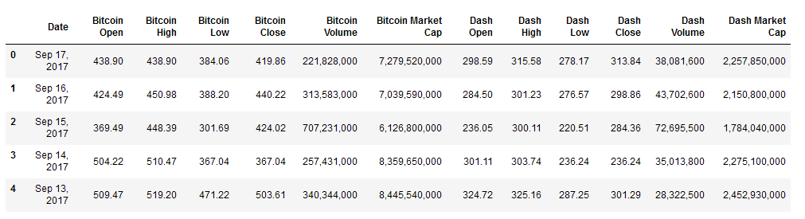
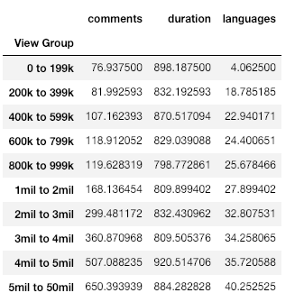

# Unit 4.3 - Merging and Data Clean Project

## Overview

Today's lesson is split into two parts. The first part will test the class' Pandas skills by having them look through buggy code and fixing the problems so it functions properly. The second part will require students to use all the tools they have learned this week to fully understand the concept of data engineering.

## Class Objectives

* Students will know how to merge DataFrames together whilst understanding the differences between inner, outer, left, and right merges.
* Students will be able to slice data using the `cut()` method and create new values based upon a series of bins.
* Students will feel more confident in their ability to fix Python/Pandas bugs within Jupyter Notebook.
* Students will be able to use Google to explore additional Pandas functionality when necessary.

- - -

# Activities Preview

* **Cryptocurrency Merging**
* You will now take some time to merge together two datasets on cryptocurrencies, one on Bitcoin and the other on Dash. You will then clean up the combined DataFrame to make it more presentable.

  * Files/Instructions:

    * [Cryptocurrency.ipynb](Activities/02-Stu_Cryptocurrency/Unsolved/Cryptocurrency.ipynb)

    * [bitcoin_cash_price.csv](Activities/02-Stu_Cryptocurrency/Unsolved/Resources/bitcoin_cash_price.csv)

    * [dash_price.csv](Activities/02-Stu_Cryptocurrency/Unsolved/Resources/dash_price.csv)

    

    * Read in both of the CSV files and print out their DataFrames.

    * Perform an inner merge that combines both DataFrames on the "Date" column.

    * Rename the columns within the newly merged DataFrame so that the headers are more descriptive.

    * Create a summary table that includes the following information: `Best Bitcoin Open`, `Best Dash Open`, `Best Bitcoin Close`, `Best Dash Close`, `Total Bitcoin Volume`, `Total Dash Volume`.

    * `Total Bitcoin Volume` and `Total Dash Volume` should be calculated to have units of "millions" and be rounded to two decimal places.

* **Binning TED**
* The class will now put their binning skills to the test by creating bins for TED Talks based upon their viewership. After creating the bins, they will then group the DataFrame based upon those bins and perform some analysis on them.

  * Files/Instructions:

    * [BinningTed.ipynb](Activities/04-Stu_TedTalks/Unsolved/BinningTed.ipynb)

    * [ted_talks.csv](Activities/04-Stu_TedTalks/Unsolved/Resources/ted_talks.csv)

    

    * Read in the CSV file provided and print it to the screen.

    * Find the minimum "views" and maximum "views".

    * Using the minimum and maximum "views" as a reference, create 10 bins in which to slice the data.

    * Create a new column called "View Group" and fill it with the values collected through your slicing.

    * Group the DataFrame based upon the values within "View Group".

    * Find out how many rows fall into each group before finding the averages for "comments", "duration", and "languages".

* **Cleaning Kickstarter**
* The class will now spend the remainder of the lesson flexing their Pandas muscles by taking a dataset similar to that of their first homework, cleaning it up, and formatting it in far less time than it would take in Excel.

  * Files/Instructions:

    * [KickstarterData.csv](Activities/06-Stu_CleaningKickstarter/Unsolved/Resources/KickstarterData.csv)

    * [KickstarterClean.ipynb](Activities/06-Stu_CleaningKickstarter/Unsolved/KickstarterClean.ipynb)

    * The instructions for this activity are contained within the Jupyter Notebook.

* **Bugfixing Bonanza!**
* The class will now be provided with a Pandas project containing TONS of bugs inside of it. Their job will be to take the application and fix it up so that it works properly. This will both put their Pandas skills to the test while also teaching them how to teach themselves.

  * Files/Instructions:

    * [BugfixBonanza.ipynb](Activities/08-Stu_BugfixingBonanza/Unsolved/BugfixBonanza.ipynb)

    * [EclipseBugs.csv](Activities/08-Stu_BugfixingBonanza/Unsolved/Resources/EclipseBugs.csv)

    * Dig through the Jupyter Notebook provided and attempt to fix as many bugs as possible. There are a lot of them and the bugs get harder to deal with as the code progresses.

    * Once you have finished bugfixing, perform some additional analysis on the dataset provided. See what interesting trends are buried deep within these bug logs for the Eclipse IDE. So long as you challenge yourself, bugs will pop up and you will get even more bugfixing practice.

    * Hints:

      * After fixing the bugs in each block of code, be sure to run the cell below for an updated error.

      * There are a few new concepts being covered within this Jupyter Notebook. The most complex of these concepts is that of multi-indexing and it is very likely that this is where many will get held up. Do not worry though, multi-indexing is not in the homework and is not required outside of this activity. It is simply an interesting/powerful feature of Pandas.

- - -

### Copyright

Trilogy Education Services © 2019. All Rights Reserved.
