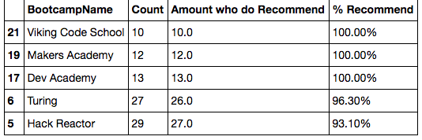

* **Data Clean-Up I**
* Data is inherently dirty. It often contains more information than is needed, columns are often mislabeled, and values are often missing or in the wrong format. This activity will require you to use most of what they've learned this week to fix just such a problem in a real-world data set.

  * Files/Instructions:

    * [2016-FCC-New-Coders-Survey-Data.csv](Activities/03-Stu_Project_Part_1/Unsolved/Resources/2016-FCC-New-Coders-Survey-Data.csv)

    * [project-part-one.ipynb](Activities/03-Stu_Project_Part_1/Unsolved/project_part_one_unsolved.ipynb)

    * The goal for this assignment is to recreate [BootcampOutputPart1.xlsx](Activities/03-Stu_Project_Part_1/Solved/output/BootcampOutputPart1.xlsx).

    * Using Pandas, load the [CSV provided in Resources](Activities/03-Stu_Project_Part_1/Unsolved/Resources/2016-FCC-New-Coders-Survey-Data.csv).

    * Create a new table using the following columns: `[0, 1, 2, 3, 4, 7, 8, 9, 10, 11, 29, 30, 32, 36, 37, 45, 48, 56, 110, 111]`.

    * The data set currently uses 0.0 to represent "No" or "False", and "1.0" to represent "Yes"/"True"—an entry of 0.0 for row 2 in the **Attended Bootcamp** column, for instance, indicates that the respondent with ID 2 did not attend a bootcamp. Replace all instances of "0.0" with No, and all instances of "1.0" with "Yes".

    * Calculate the total number of respondents in the sub-table you built.

    * Create a table out of the rows corresponding only to people who _did_ attend a bootcamp.

    * Calculate the number of people who attended a bootcamp.

    * Calculate the average age of bootcamp attendees.

    * Calculate the number of bootcamp attendees who self-identify as male; female; or neither.

    * Calculate the number of bootcamp attendees who hold college degrees.

    * Calculate the percentage of respondents who attended a bootcamp.

    * Calculate the percentage of people who attended a bootcamp and hold a college degree.

    * Calculate the average post-bootcamp salary.

    * Create a new, two-row table collecting the above data.

    * Use the `format` method to prettify your table—i.e., use `format` to display percents as percents; display numbers to a reasonable number of decimal points; etc.

    * Finally, export the final table into an Excel file.

* **Data Clean-Up II**
* The next activity will require you to clean and explore the same dataset in order to generate a very different set of summary data.

  * Files/Instructions:

    * [2016-FCC-New-Coders-Survey-Data.csv](Activities/04-Stu_Project_Part_2/Unsolved/Resources/2016-FCC-New-Coders-Survey-Data.csv)

    * [04-Stu_Project_Part_2](Activities/04-Stu_Project_Part_2/Unsolved/project_part_two_unsolved.ipynb)

    

    * Create a new table using the following columns: `[0, 1, 2, 3, 4, 6, 7, 8, 9, 10, 11, 29, 30, 32, 36, 37, 45, 48, 56, 110, 111]`.

    * The dataset currently uses 0.0 to represent "No" or "False", and "1.0" to represent "Yes"/"True". Replace all instances of "0.0" with No, and all instances of "1.0" with "Yes".

    * Extract rows corresponding only to respondents who attended a bootcamp.

    * Create a DataFrame with two columns: One with the bootcamp name, and one with the number of respondents who went to each bootcamp.

    * Create another DataFrame with two columns: One for the bootcamp name, and one for the number of respondents who recommend it.

    * Create a new DataFrame by merging the previous two DataFrames on the appropriate column.

    * In your new DataFrame, create a new column containing the percentage of respondents for each bootcamp who would recommend that bootcamp.

    * Sort the new DataFrame in descending order of the percentage of recommenders you just calculated.

    * Use `map` and `format` to make the `"% Recommended"` column look more presentable.

    * Finally, export your DataFrame to an Excel file.