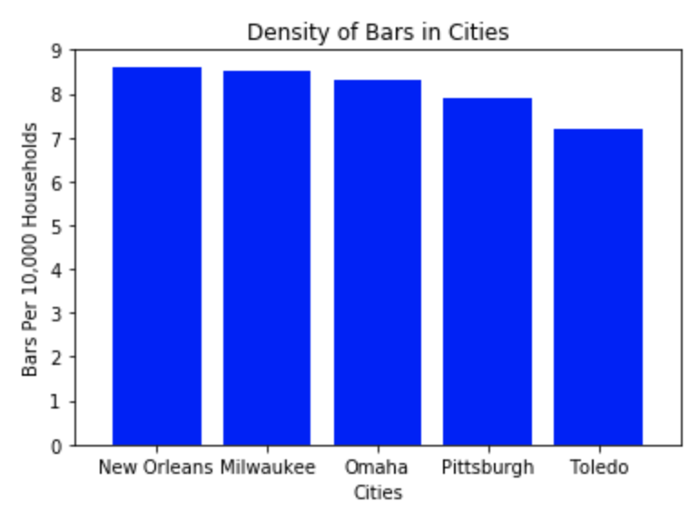
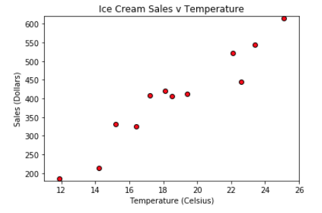

# Unit 5.1 - Introduction to Matplotlib

## Overview

Today's class will introduce students to the basics of [Matplotlib](http://Matplotlib.org/), one of the most popular Python plotting libraries in use today. This lesson plan focuses on how to import the `matplotlib` library and how to utilize its core `pyplot` module in order to design and customize line, bar, scatter and pie charts. Today will also serve as a refresher of data visualizations introduced in Unit 1.

### Class Objectives

By the end of today's class, students will be able to:

* Use Matplotlib's Pyplot interface.

* Create line, bar, scatter, and pie charts.

* Change the appearance of their plots.

* Identify basic plot configuration options, such as `xlim` and `ylim.`

- - -

# Activities Preview

* **New Jersey Weather**
* In this activity, students will create a series of line plots using temperature data from New Jersey.

  * Files/Instructions:
  
    * [README](Activities/02-Stu_NJTemp/README.md):
    
    * [02-Stu_NJTemp/Unsolved/nj_temp.ipynb](Activities/02-Stu_NJTemp/Unsolved/nj_temp.ipynb)

* **Legendary Temperature**
* In this activity, students will edit the line plots they created earlier so that these charts are more visually interesting.

  * Files/Instructions:

    * [README](Activities/04-Stu_LegendaryTemperature/README.md)
    
    * [avg_temp.png](Activities/04-Stu_LegendaryTemperature/Images/avg_temp.png)

    

* **Coaster Speed**
* In this activity, students will create a line chart that graphs the speed of a roller coaster over time. They will then style the chart and add some aesthetics to it.

  * Files/Instructions:
  
    * [README](Activities/06-Stu_RollerCoaster/README.md)
  
    * [Coaster Speed Chart](Activities/06-Stu_RollerCoaster/Images/CoasterSpeed.png)

    

* **Bars Bar Chart**
* In this activity, students will create a bar chart that visualizes the density of bars within major U.S. cities.

  * Files/Instructions:
  
    * [README.md](Activities/08-Stu_PyBars/README.md)

    * [08-Stu_PyBars/py_bars.ipynb](Activities/08-Stu_PyBars/Unsolved/py_bars.ipynb)

    * [Bars Bar Chart](Activities/08-Stu_PyBars/Images/BarDensity.png)

    

* **Pies Pie Chart**
* In this activity, students will create a pie chart that visualizes the favorite pies within the United States.

  * Files/Instructions:
  
    * [README.md](Activities/10-Stu_PyPies/README.md)

    * [10-Stu_PyPies/py_pie.ipynb](Activities/10-Stu_PyPies/Unsolved/py_pie.ipynb)

    * [Pies Pie Chart](Activities/10-Stu_PyPies/Images/PyPies.png)

    

* **Scatter Py**
* In this activity, students will create a scatter plot that visualizes ice cream sales in comparison to temperature increases.

  * Files/Instructions:
  
    * [README.md](Activities/12-Stu_ScatterPy/README.md)

    * [12-Stu_ScatterPy/ice_cream_sales.ipynb](Activities/12-Stu_ScatterPy/Unsolved/ice_cream_sales.ipynb)

    * [IceCreamSales Chart](Activities/12-Stu_ScatterPy/Images/IceCreamSales.png)

    

* **Average Rainfall**
* In this activity, students will import data from a CSV file to create a bar chart that shows the average rainfall in different states. This will require them to think outside the box and try using Pandas alongside Matplotlib.

  * Files/Instructions:

    * [README](Activities/13-Stu_AvgRain/README.md)

    * [avg_rain_state.csv](Activities/13-Stu_AvgRain/Resources/avg_rain_state.csv)

    * [avg_state_rain.ipynb](Activities/13-Stu_AvgRain/Unsolved/avg_state_rain.ipynb)

    * [avg_state_rain.png](Activities/13-Stu_AvgRain/Images/avg_state_rain.png)

    

- - -

### Copyright

© 2019 Trilogy Education Services
