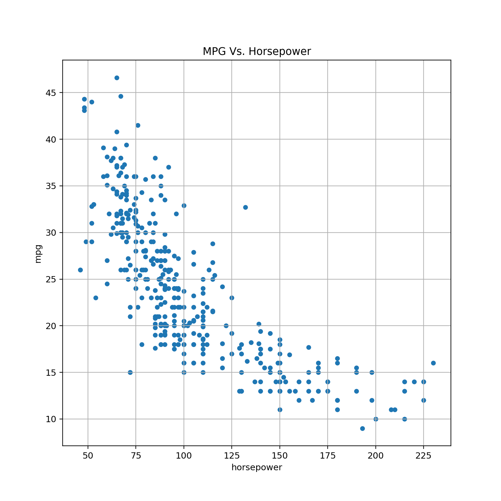

# Unit 5.2 - Plotting With Pandas

## Overview

Today's lesson plan introduces students to Pandas plotting, a quick and effective means to create charts using DataFrames.

## Class Objectives

By the end of today's class, students will be able to:

* Create plots using the `DataFrame.plot()` method.
* Explain the advantages and disadvantages of creating charts using the `DataFrame.plot()` method.
* Use Pandas to analyze a complex dataset and chart the visualizations.

- - -

# Activities Preview

* **PyPlot Warmup**
* In this activity students will use PyPlot to create the most effective visualization for a variety of datasets.

  * Files/Instructions:
  
    * [README.md](Activities/01-Stu_PlotsReview/README.md)
  
    * [plot_drills.ipynb](Activities/01-Stu_PlotsReview/Unsolved/plot_drills.ipynb)

* **Battling Kings**
* In this activity, students will create a bar chart that visualizes which kings within the Game of Thrones universe have participated in the most battles. This means that students will need to clean up and analyze a Pandas DataFrame before creating their plot.

  * Files/Instructions:
  
    * [README](Activities/03-Stu_BattlingKings/README.md)
  
    * [battling_kings.ipynb](Activities/03-Stu_BattlingKings/Unsolved/battling_kings.ipynb)

* **Bike Trippin'**
* In this activity, students will create a pair of charts based on community bike data collected from Seattle. This activity will require them to create and analyze groupby objects before printing some visualizations of their findings to the screen.

  * Files/Instructions:
  
    *  [README](Activities/05-Stu_BikeTrippin/README.md)

    * [bike_trippin.ipynb](Activities/05-Stu_BikeTrippin/Unsolved/bike_trippin.ipynb)

    * [trip.csv](Activities/05-Stu_BikeTrippin/Resources/trip.csv)

* **Miles Per Gallon**
* In this activity, students will create a scatter plot using vehicle data, Pandas, and Matplotlib.

  * **Files/Instructions:

    * [README](Activities/06-Stu_MilesPerGallon/Instructions.md)

    * [mpg.ipynb](Activities/06-Stu_MilesPerGallon/Unsolved/mpg.ipynb)

    * [MPG.csv](Activities/06-Stu_MilesPerGallon/Resources/mpg.csv)

    

* **Winner Wrestling**
* The rest of class will be dedicated to creating a plot using Pandas and Matplotlib that allows its viewers to visualize the recent careers of professional wrestlers. This mini-project has been broken down into 3 parts and was designed for students to work alongside each other in groups.  In the first part, students will take 4 CSV files and merge them. They will then need to rename and style the columns so that they reflect the data properly. In the second part, groups will create new columns for their DataFrame which will inform readers of how many matches a wrestler has won, lost, drawn, and taken part in over the course of their career. In this final part, the class will take the DataFrame they created and, using Matplotlib, chart the number of wins and losses an individual wrestler has had over the course of a career.

  * Files/Instructions:
  
    * [README.md](Activities/08-Stu_WinnerWrestling-Part1/README.md)

    * [winning_wrestlers.ipynb](Activities/08-Stu_WinnerWrestling-Part1/Unsolved/winning_wrestlers.ipynb)

    * [WWE-Data-2013.csv](Activities/08-Stu_WinnerWrestling-Part1/Resources/WWE-Data-2013.csv)

    * [WWE-Data-2014.csv](Activities/08-Stu_WinnerWrestling-Part1/Resources/WWE-Data-2014.csv)

    * [WWE-Data-2015.csv](Activities/08-Stu_WinnerWrestling-Part1/Resources/WWE-Data-2015.csv)

    * [WWE-Data-2016.csv](Activities/08-Stu_WinnerWrestling-Part1/Resources/WWE-Data-2016.csv)

    

    * Instructions: The instructions for subsequent parts are contained in the unsolved version.

    * [winning_wrestlers.ipynb](Activities/08-Stu_WinnerWrestling-Part1/Unolved/winning_wrestlers.ipynb)

    

    * [winning_wrestlers.ipynb](Activities/10-Stu_WinnerWrestling-Part3/Unsolved/winning_wrestlers.ipynb)

    

- - -

 © 2019 Trilogy Education Services
