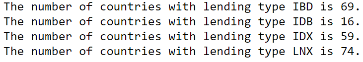

# Unit 6.2 - Working with Weather & City APIs

## Overview

Today's class introduces the class to a number of new APIs whilst also discussing API wrappers, exception handling, and using Pandas with API responses.

## Class Objectives

* Students will create applications from scratch using nothing but their knowledge of Python and an API documentation
* Students will load JSON from API responses into a Pandas DataFrame
* Students will be able to use `try` and `except` blocks to handle errors

- - -

# Activities Preview

* **JSON Traversal**
* Today's class will focus on making our get requests more robust. We will also explore different methods of storing and analyzing our API responses.

  * Files/Instructions:
  
    * [README.md](Activities/01-Stu_JSONTraversalReview/README.md)

    * [youtube_response.json](Activities/01-Stu_JSONTraversalReview/Resources/youtube_response.json)

    * [Stu_JSON_Traversal.ipynb](Activities/01-Stu_JSONTraversalReview/Unsolved/Stu_JSON_Traversal.ipynb)

* **Requests Review**
* For this activity, students will be making an API call to a NYT scraper and printing out data from the response.

  * File/Instructions:
  
    * [README.md](Activities/02-Stu_RequestReview/README.md)
  
    * [Stu_RequestReview.ipynb](Activities/02-Stu_RequestReview/Unsolved/Stu_RequestReview.ipynb)

* **Weather in Burundi**
* The class will now work with the OpenWeather API and create an application which provides the user with the current temperature in the largest city of Burundi.

  * File/Instructions:
  
    * [README.md](Activities/04-Stu_Burundi/README.md)
  
    * [Stu_Burundi.ipynb](Activities/04-Stu_Burundi/Unsolved/Stu_Burundi.ipynb)

    

* **TV Ratings**
* The class will now take some time to create an application that reads in a list of TV shows, makes multiple requests from an API to retrieve rating information, creates a pandas dataframe, and visually displays the data.

  * File/Instructions:
  
    * [README.md](Activities/06-Stu_TVRatings/README.md)
  
    * [Stu_TVRatings.ipynb](Activities/06-Stu_TVRatings/Unsolved/Stu_TVRatings.ipynb)

    

* **Weather Statistics**
* The class will now generate a regression model on a dataset from the Open Weather API to predict the temperature of a city.

  * Files/Instructions:
  
    * [README.md](Activities/07-Stu_Weather_Stats/README.md)
  
    * [weather_stats.ipynb](Activities/07-Stu_Weather_Stats/Unsolved/weather_stats.ipynb)

* **Making Exceptions**
* Students will create an application that, through `try` and `except`, resolves a number of errors.

  * File/Instructions:
  
    * [README.md](Activities/09-Stu_MakingExceptions/README.md)
  
    * [Stu_MakingExceptions.ipynb](Activities/09-Stu_MakingExceptions/Unsolved/Stu_MakingExceptions.ipynb)

* **API Call Exceptions**
* In this activity, students will implement try/except as they make API calls to narrow down a list of fictional characters to include only characters from Star Wars.

  * Files/Instructions:
  
    * [README.md](Activities/10-Stu_API_Exceptions/README.md)
  
    * [api_exceptions.ipnyb](Activities/10-Stu_API_Exceptions/Unsolved/api_exceptions.ipynb)

* **Two Calls**
* For this activity, students will be utilizing the World Bank API to make two API calls in sequence. The second API call depends on the response of the first.

  * File/Instructions:
  
    * [12-Stu_TwoCalls/README.md](Activities/12-Stu_TwoCalls/README.md)
  
    * [Stu_TwoCalls.ipynb](Activities/12-Stu_TwoCalls/Unsolved/Stu_TwoCalls.ipynb)

    

- - -

### Copyright

Trilogy Education Services © 2019. All Rights Reserved.
