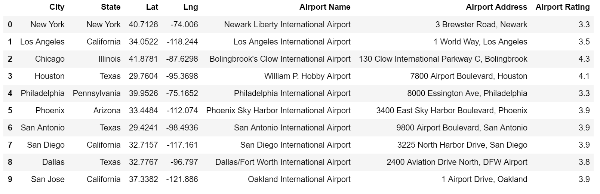

## Unit 6.3 - Bank Deserts

## Overview

In this class, students will be introduced to the Google Maps and Places API as well as Jupyter gmaps. Using these new tools, along with data from the US Census, students will be tasked with creating visualizations to capture the socioeconomic trend of [banking deserts](http://www.theatlantic.com/business/archive/2016/03/banking-desert-ny-fed/473436/).

### Class Objectives

* Students will be able to successfully use the Google Maps and Places API to obtain information about geographic areas.
* Students will understand how to use the Census API wrapper.
* Students will understand the concept of rate limits and the importance of creating "test cases" prior to running large scripts.
* Students will have a firmer understanding of how to dissect new API documentation.
* Students will be able to visually represent data on a map with Jupyter Gmaps.

- - -

# Activities Preview

* **Google Drills**
* The class will now create some code that makes calls to both the Google Places and Google Geocoding APIs.

  * File/Instructions:
  
    * [README.md](Activities/03-Stu_Google_Drills/README.md)
  
    * [Google_That.ipynb](Activities/03-Stu_Google_Drills/Unsolved/Google_That.ipynb)

* **Google Complex**
* In this activity, they will be tasked with obtaining the rating of every airport in the top 100 metropolitan areas according to Google Users. They will be given a list of airports and cities, and will need to use the Google Geocoding API and Google Places API to obtain the rating information.

  * Files/Instructions:
    
    * [README.md](Activities/05-Stu_Google_Complex/README.md)

    * [Airport_Ratings.ipynb](Activities/05-Stu_Google_Complex/Unsolved/Airport_Ratings.ipynb)

    * [Cities.csv](Activities/05-Stu_Google_Complex/Resources/Cities.csv)

    

* **Hot Airports**
* In this activity students will create a heat map based on airport ratings.

  * Files/Instructions:
  
    * [README.md](Activities/07-Stu_Airport_Map/README.md)

    * [Airport_Output.csv](Activities/07-Stu_Airport_Map/Resources/Airport_Output.csv)

    * [airport_heatmap.ipynb](Activities/07-Stu_Airport_Map/Unsolved/airport_heatmap.ipynb)

* **Census Activity**
* In this activity students will utilize the Census API to obtain census data at a state level and visualize it with gmaps.

  * Files/Instructions:
  
    * [README.md](Activities/09-Stu_Census/README.md)
  
    * [09-Stu_Census/Census_States.ipynb](Activities/09-Stu_Census/Unsolved/Census_States.ipynb)

* **Banking Deserts Heatmap**
* Students will be creating a data visualization to understand how prominent the "banking desert" phenomenon truly is. In order to accomplish this, they will be utilizing the US Census and their newfound skills with the Google Geocoder API and Jupyter gmaps. "Banking deserts" are a socioeconomic phenomenon in which many low-income and elderly areas tend to have no or few banking services available. The end-result is that these communities are often preyed upon by high-interest "check cashing" and "fast cash now" providers.

  * Files/Instructions:
  
    * [README.md](Activities/10-Stu_BankDeserts_Heatmap/README.md)

    * [zip_bank_data.csv](Activities/10-Stu_BankDeserts_Heatmap/Resources/zip_bank_data.csv)

    * [Unsolved/Banking_Deserts_HeatMap.ipynb](Activities/10-Stu_BankDeserts_Heatmap/Unsolved/Banking_Deserts_HeatMap.ipynb)
    
    * [banking deserts](https://www.theatlantic.com/business/archive/2016/03/banking-desert-ny-fed/473436/)

- - -

### Copyright

Trilogy Education Services © 2019. All Rights Reserved.
