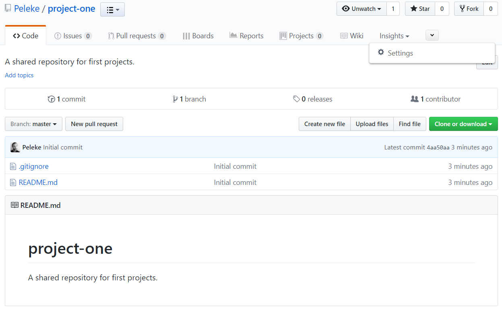
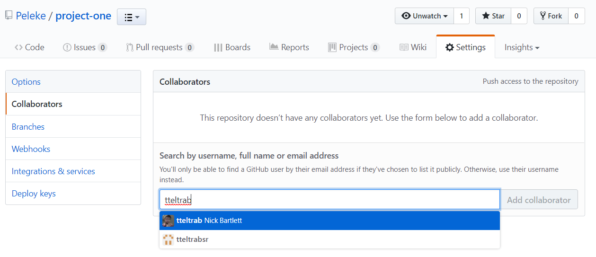

# Unit 7.1 - Projects & Collaboration with Git

## Overview

Today's lesson plan introduces students to the requirements for Project 1, as well as the basics of collaboration with Git.

## Class Objectives

* Students must be able to articulate the requirements for Project 1.
* Students must be able to draw and interpret diagrams of Git branching workflows.
* Students must be able to create new branches with Git.
* Students must be able to push local branches to GitHub.

- - -

# Activities Preview

* **Creating a Project Repo**
* We'll  set up a GitHub repository that students can use for their projects.

  * Files/Instructions:
    * Groups should choose _one_ member to follow along. This will be the repo that the group shares through projects.

      * Go to [GitHub](https://github.com/), and click on the plus button in the top right to create a new repo.

        

        * Fill out the fields on the new repo page.

        * Students _should_ initialize with a `.gitignore`.

        * Students should choose `Python` in the gitignore dropdown.

        * Students should edit the `.gitignore` file and add:

        ``` python
        # DS_Store
        .DS_Store
        ```

        

        * This is sufficient to create a repository that everyone can share.

    * "open up" the repo by adding **collaborators**.

      * Navigate to the repository settings.

      

      * Navigate to the collaborators tab, and enter your password when prompted.

      

      * From here, students can search for their teammates by username.

      

      * Everyone in each group should now be able to make changes to the shared repo.

    * Students in charge of creating their group's repository should slack the remote URL (i.e., the link to the repo) to their teammates.

      * Team members will `git clone` this link.

      * By default, only the creator of the repo can push changes.

      * _everyone in the group must clone the new repository_.

    * Make sure that everyone has done this before moving on.

* **Workflows**
* In this activity, students will take a few minutes to review the concepts they have learned.

  * File: [Activities/02-Stu_Workflows/README.md](Activities/02-Stu_Workflows/README.md)

* **Project Work**
* Students should spend the remainder of class working with their groups to develop a project proposal.

- - -

### Copyright

Trilogy Education Services © 2019. All Rights Reserved.
