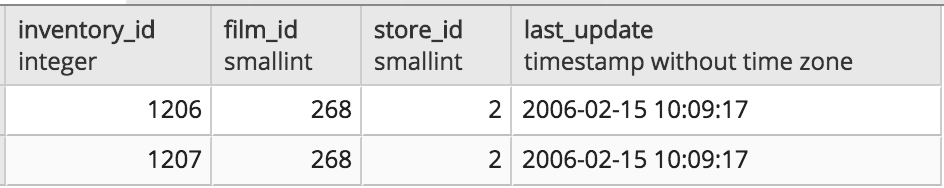

# Unit 9.2 - Advanced SQL Queries

## Overview

Today's class will introduce students to additional features of the SQL language. Students will dive deeper into queries with aggregates, grouping, and ordering. Today's lesson will also cover subqueries, creating views, and how to combine both features.

## Class Objectives

By the end of today's class, students will be able to:

- Create aggregate queries.
- Create subqueries to explore data further.
- Create views and run subqueries off of them.

- - -

# Activities Preview

* **Gregarious Aggregates**
* In this activity, students will practice writing queries with aggregate functions, with grouping, and with using aliases.
  * Files/Instructions:
  
    * [README.md](Activities/03-Stu_GregariousAggregates/README.md)
    
    * [query.sql](Activities/03-Stu_GregariousAggregates/Unsolved/query.sql)
  
* **Movies Ordered By**
* In this activity, you will use `ORDER BY` in combination with other SQL methods to query and order the tables.

  * Files/Instructions: [README.md](Activities/05-Stu_Order_By/README.md)

* **Subqueries**
* In this activity, students will practice creating subqueries.

  * Files/Instructions: [README.md](Activities/07-Stu_Subqueries/README.md)

* **A View with a Roomful of Queries**
* In this activity, students will pair up and practice their join and subquery skills, as well as build out a view.

  * files/Instructions:
  
    * [README.md](Activities/09-Stu_View_Room_Queries/README.md)

    

* **Mine the Subquery**
* In this activity, students will continue to practice subqueries. Students can either work individually or in pairs.

  * Files/Instructions: [README.md](Activities/11-Stu_Mine_the_Subquery/README.md)

- - -

### Copyright

© 2019 Trilogy Education Services
