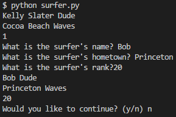
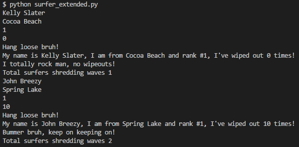

# Unit 10.1 - Introduction to SQLAlchemy

## Overview

Today's lesson will introduce students to the SQLAlchemy library for Python.

## Class Objectives

* Students will  be able to connect to a SQL database using SQLAlchemy
* Students will learn to perform basic SQL queries using engine.execute()
* Students will learn how to create Python classes and objects
* Students will  be able to create, read, update, and delete data from a SQL database using SQLAlchemy's ORM

- - -

# Activities Preview

* **Looking Into SQLAlchemy**
* Before diving into SQLAlchemy, research the following questions...

  * What is an ORM?

  * What are the benefits to using an ORM?

  * What are some of the disadvantages to using an ORM?

  * You can refer to this ORM, [SQLAlchemy](https://www.sqlalchemy.org/features.html), features page.

* **Ice Cream Connection**
* In this activity, students will be creating a new database and connection to it using SQLAlchemy. They will then read the data in with `engine.execute()`.

  * Files/Instructions: 
  
    * [02-Stu_IceCreamStore/README.md](Activities/02-Stu_IceCreamStore/README.md)

    * [02-Stu_IceCreamStore/IceCreamConnector.ipynb](Activities/02-Stu_IceCreamStore/Unsolved/IceCreamConnector.ipynb)

    * [02-Stu_IceCreamStore/Resources/icecreamstore.csv](Activities/02-Stu_IceCreamStore/Resources/icecreamstore.csv)

* **Read All the SQL**
* Students will now query an external server using Pandas and SQLAlchemy as they work to create new dataframes based on US census data.

  * Files/Instructions:
  
    * [04-Stu_ReadAllTheSQLs/README.md](Activities/04-Stu_ReadAllTheSQLs/README.md)

    * [04-Stu_ReadAllTheSQLs/Census_Data.csv](Activities/04-Stu_ReadAllTheSQLs/Resources/Census_Data.csv)

    * [04-Stu_ReadAllTheSQLs/zip_census.csv](Activities/04-Stu_ReadAllTheSQLs/Resources/zip_census.csv)

    * [04-Stu_ReadAllTheSQLs/Read_All_The_SQLs.ipynb](Activities/04-Stu_ReadAllTheSQLs/Unsolved/Read_All_The_SQLs.ipynb)

* **Surfer Class**
* Students will now work on creating their own classes in Python. More specifically, they will be creating a "Surfer" class which will be used more throughout today's lesson.

  * Files/Instructions:
  
    * [07-Stu_Surfer_Class/README.md](Activities/07-Stu_Surfer_Class/README.md)
  
    * [07-Stu_Surfer_Class/Surfer.ipynb](Activities/07-Stu_Surfer_Class/Unsolved/Surfer.ipynb)

    

* **Surfer Class Extended**
* The class will now be reworking their Surfer script from earlier as they add in some methods to perform some specific tasks.

  * File/Instructions:
  
    * [09-Stu_Surfer_Class_Extended/README.md](Activities/09-Stu_Surfer_Class_Extended/README.md)
  
    * [09-Stu_Surfer_Class_Extended/Surfer_Extended.ipynb](Activities/09-Stu_Surfer_Class_Extended/Unsolved/Surfer_Extended.ipynb)

    

* **Surfing SQL**
* Students will now test their SQLAlchemy skills as they attempt to turn their Surfer class from earlier into a new table on a SQL database whilst also creating a new Board class.

  * Files/Instructions:
  
    * [11-Stu_Surfer_SQL/README.md](Activities/11-Stu_Surfer_SQL/README.md)
  
    * [11-Stu_Surfer_SQL/Surfer_SQL.ipynb](Activities/11-Stu_Surfer_SQL/Unsolved/Surfer_SQL.ipynb)

- - -

### Copyright

Trilogy Education Services (C) 2019. All Rights Reserved.
