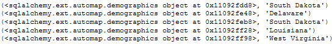

# Unit 10.2 - Advanced Usage of the SQLAlchemy ORM

## Overview

Today's lesson introduces students to some more of the nitty-gritty details of working with the SQLAlchemy ORM, including how to create complex queries, update rows, perform joins, and use ORM methods to perform queries.

## Class Objectives

* Students will be able to use the SQLAlchemy ORM to create classes that model tables.
* Students will be able to perform database CRUD operations using the SQLAlchemy ORM.
* Students will be able to reflect existing databases.
* Students will be able to use the SQLAlchemy Inspector to view table names in the database.
* Students will be able to plot the query results from the ORM.

- - -

# Activities Preview

* **Shark Search**
* Students will now take some time to create a Python script that can search through the SQL file of shark attacks provided.

  * Files/Instructions:
  
    * [02-Stu_SharkSearch/README.md](Activities/02-Stu_SharkSearch/README.md)

    * [02-Stu_SharkSearch/sharks.sql](Activities/02-Stu_SharkSearch/Resources/sharks.sql)

    * [02-Stu_SharkSearch/Stu_SharkSearch.ipynb](Activities/02-Stu_SharkSearch/Unsolved/Stu_SharkSearch.ipynb)

* **What a Cruddy Database**
* In this activity, pairs of students will be tasked with creating a new SQLite database for a garbage collection company. They will need to create a table, add rows into the table, update some values in some rows, and finally delete a row from the database.

  * Files/Instructions:
  
    * [04-Par_CruddyDB/README.md](Activities/04-Par_CruddyDB/README.md)

    * [04-Par_CruddyDB/Par_CruddyDB.ipynb](Activities/04-Par_CruddyDB/Unsolved/Par_CruddyDB.ipynb)

* **Reflecting on SQL**
* Students will now practice their ability to reflect existing databases using SQLAlchemy and a SQLite table focused upon demographic data.

  * Files/Instructions:
  
    * [06-Stu_ReflectingOnSQL/README.md](Activities/06-Stu_ReflectingOnSQL/README.md)

    * [06-Stu_ReflectingOnSQL/Stu_Reflection.ipynb](Activities/06-Stu_ReflectingOnSQL/Solved/Stu_Reflection.ipynb)

    * [06-Stu_Reflecting/Resources/demographics.sqlite](Activities/06-Stu_ReflectingOnSQL/Resources/demographics.sqlite)

    

* **Salary Exploration**
* Students will now take some time to create an inspector and search through a SQLite database of salaries from San Francisco.

  * Files/Instructions:
    
    * [08-Stu_SalaryExplore/README.md](Activities/08-Stu_SalaryExplore/README.md)

    * [08-Stu_SalaryExplore/database.sqlite](Activities/08-Stu_SalaryExplore/Resources/database.sqlite)

    * [08-Stu_SalaryExplore/Unsolved/Stu_Salary_Explorer.ipynb](Activities/08-Stu_SalaryExplore/Unsolved/Stu_Salary_Explorer.ipynb)

* **Emoji Plotting**
* For this activity, students will join forces to create a plot based upon the data stored within a SQLite database. Using the knowledge they have accrued thus far and SQLAlchemy's documentation, they should be able to accomplish this task.

  * Files/Instructions:

    * [09-Par_EmojiPlotting/README.md](Activities/09-Par_EmojiPlotting/README.md)

    * [09-Par_EmojiPlotting/emoji.sqlite](Activities/09-Par_EmojiPlotting/Resources/emoji.sqlite)

    * [09-Par_EmojiPlotting/Stu_Plotting.ipynb](Activities/09-Par_EmojiPlotting/Unsolved/Stu_Plotting.ipynb)

- - -

### Copyright

Trilogy Education Services © 2019. All Rights Reserved.
