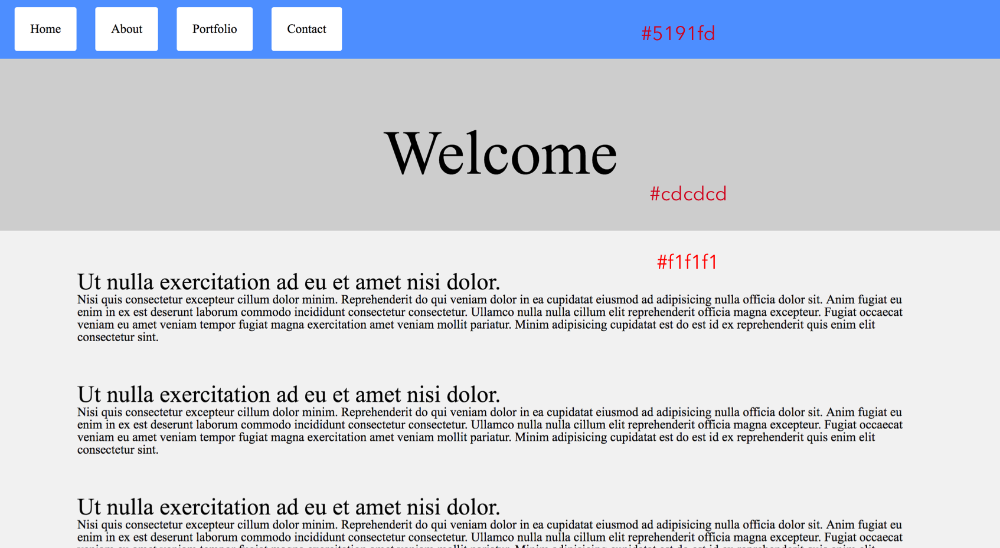

# Unit 11.3 - Bootstrap

## Overview

In today's class, we introduce students to the Bootstrap CSS framework.

## Class Objectives

* Students will be able to discuss media queries, the technology that is used to create the responsive Bootstrap grid.

* Students will cover the Bootstrap Grid, and discover how to utilize it to position the elements on the page.

* Students will discover how to quickly and easily build web pages using pre-built Bootstrap components.

- - -

# Activities Preview

* **Styling Classes and IDs**
* For this activity you'll create a CSS layout from this image already supplied.

  * Files/Instructions:
  
    * [README](Activities/01-Stu_ReviewActivity/README.md)
  
    * [01-Stu_ReviewActivity](Activities/01-Stu_ReviewActivity/Unsolved) unsolved folder.

    

* **Chrome Devtools**
* For this activity, students will be modifying a website of their choice using Chrome Devtools. Each student should take a screenshot of the website they modified and post it in the class's slack channel.

  * Instructions: [README](Activities/02-Stu_ChromeDevtools/README.md)

* **Media Queries**
* For this activity, students will be modifying the solution to the last CSS review activity to be more mobile responsive using media queries.

  * Instructions: [README](Activities/04-Stu_MediaQueries/README.md)

* **Lorem Grid**
* For this activity, students will be given an image of a simple web page layout created using the Bootstrap grid. They will attempt to recreate this layout from scratch.

  * Instructions: [README](Activities/06-Stu_LoremGrid/README.md)

* **Bootstrap Components**
* For this activity, students will create a basic web page using Bootstrap components.

  * Instructions: [README](Activities/07-Stu_BootstrapComponents/README.md)

* **Clone a Website**
* For this activity, students will attempt to recreate an existing website using the Bootstrap grid and Bootstrap components.

  * Instructions: [README](Activities/09-Stu_CloneAWebsite/README.md)

- - -

### Copyright

Trilogy Education Services © 2019. All Rights Reserved.
