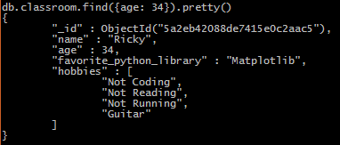

# Unit 12.1 - Mastering MongoDB

## Overview

In this class, students will be introduced to the concept of the NoSQL database with MongoDB. By the end of the day, students should be able to perform basic CRUD operations with MongoDB and the Pymongo library.

## Class Objectives

* Students will be able to create and connect to local MongoDB databases

* Students will learn to create, read, update, and delete MongoDB documents using the Mongo Shell

* Students will create simple Python applications that connect to and modify MongoDB databases using the PyMongo library

- - -

# Preclass Activity
* **Installing MongoDB**
* MongoDB installation guides:

  * [Mac Install Guide](https://docs.mongodb.com/manual/tutorial/install-mongodb-on-os-x/)

  * [Windows Install Guide](https://docs.mongodb.com/manual/tutorial/install-mongodb-on-windows/)

  * Start up MongoDB by typing `mongod` into their terminal/bash windows. The terminal/bash screens should look something like this:

    

  * `mongod` may automatically start, causing it to return an error. 
  
  * You can double check that MongoDB is working by running `mongo`.

* **Compass Playground**
* Now that the we have MongoDB Compass installed, take some time to play around with the application.

- - -
# Activities Preview
* **Quick Mongo Research**
* Work with a partner to answer the following questions:

  * What are the advantages of using a NoSQL database like MongoDB according to the MongoDB Website?

  * What are the advantages of using a NoSQL database like MongoDB according to the web (places like Quora)?

  * What are the disadvantages of using a NoSQL database like MongoDB according to the web (places like Quora)?
  
* **Mongo Class**
* In this activity, students will familiarize themselves with the basic query operations in MongoDB. Specifically, they will practice inserting and finding documents.

  * Files/Instructions:

    

    * Use the command line to create a `ClassDB` database

    * Insert entries into this database for yourself and the people around you within a collection called `students`

    * Each document should have a field of `name` with the person's name, a field of `favorite_python_library` for the person's favorite Python library, a field of `age` for the person's age, and a field of `hobbies` which will hold a list of that person's hobbies.

    * Use the `find()` commands to get a list of everyone of a specific age before using `name` to collect the entry for a single person.

    * Bonus: Check out the MongoDB documentation and figure out how to find users by an entry within an array.

* **Dumpster_DB**
* In this activity, students will gain further practice with CRUD operations in MongoDB as they create a database centered around dumpster diving.

  * Files/Instructions:

    

    * Create and use a new database called `Dumpster_DB` using the Mongo shell.

    * Create a collection called `divers` which will contain a string field for `name`, an integer field for `yearsDiving`, a boolean field for `stillDiving`, and an array of strings for `bestFinds`.

    * Insert three new documents into the collection. Be creative with what you put in here and have some fun with it.

    * Update the `yearsDiving` fields for your documents so that they are one greater than their original values.

    * Update the `stillDiving` value for one of the documents so that it is now false.

    * Push a new value into the `bestFinds` array for one of the documents.

    * Look through the collection, find the diver with the smallest number of `bestFinds`, and remove it from the collection.

* **Mongo Grove**
* In this activity, students will build a command-line interface application for the produce department of a supermarket. They will have to use PyMongo to enable Python to interact with MongoDB.

  * Files/Instructions:

    * Use Pymongo to create a `fruits_db` database, and a `fruits` collection.

    * Into that collection, insert two documents of fruit shipments received by your supermarket. They should contain the following information: vendor name, type of fruit, quantity received, and ripeness rating (1 for unripe, 2 for ripe, 3 for over-ripe).

    * Because not every supermarket employee is versed in using MongoDB, your task is to build an easy-to-use app that can be run from the console.

    * Build a Python script that asks the user for the above information, then inserts a document into a MongoDB database.

    * It would be good to Modify the app so that when the record is entered, the current date and time is automatically inserted into the document.

    * Hint: Consult the [documentation](https://docs.python.org/3/library/datetime.html) on the `datetime` library.

- - -

### Copyright

Trilogy Education Services © 2019. All Rights Reserved.
