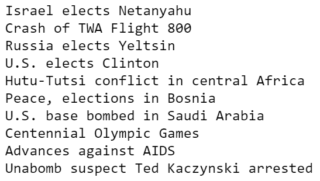
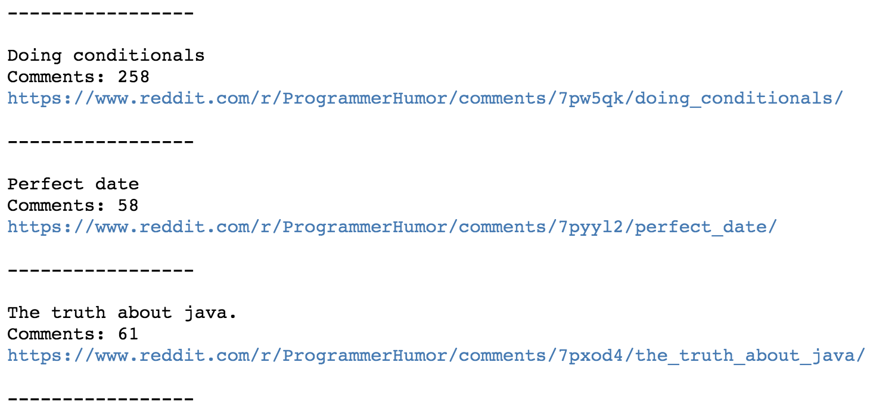

# Unit 12.2 - Kiss My Fist and Scrape the Sky

## Overview

Today's lesson dives into scraping websites with the Beautiful Soup library for Python. Students will start out scraping simple HTML strings before moving onto live web pages.

## Class Objectives

* Students will be able to use Beautiful Soup to scrape their own data from the web.
* Students will learn to save the results of web scraping into MongoDB.

- - -

# Activities Preview

* **CNN Soup**
* In this activity, students will take their first steps in web scraping by taking an external HTML file, parsing it, and then printing out specific elements to the console.

  * Files/Instructions:

    
    
    * [Stu_CNN-Unsolved.ipynb](Activities/02-Stu_CNNSoup/Unsolved/Stu_CNN-Unsolved.ipynb)

    * Believe it or not, CNN's website for [1996: Year in Review](http://edition.cnn.com/EVENTS/1996/year.in.review/) is still alive on the web! We have, however, stored the HTML document as a string in your starter file.

    * Your task, should you accept it (and you should), is to use Beautiful Soup to scrape and print the following pieces of information:

      1. The title of the webpage

      2. All paragraph texts on the page

      3. The top 10 headlines for the year. This last one is a bit tricky and may not come out perfectly!

    * Hint: For the third task in this activity you will need a means of filtering the data... Perhaps over multiple iterations... With a loop... HINT HINT!

    * Bonus: If you finish early, head over to the [Beautful Soup documentation](https://www.crummy.com/software/BeautifulSoup/bs4/doc/) to read up on accessing attributes and navigating the DOM.

* **Reddit Scraper**
* In this activity, students will scrape the Python Reddit for potentially interesting content. They will also have to filter for threads with twenty or more comments in them.

  * Files/Instructions:

     

    * In this activity, you will scrape the [Python Reddit](https://www.reddit.com/r/Python/) using Beautiful Soup. Scrape only threads that have twenty or more comments and then print the thread's title, number of comments, as well as the URL for the thread.

* **Hockey Headers**
* In this activity, students will scrape the news page of the NHL website for articles and then post the title/header of each article to MongoDB.

  * Files/Instructions:

    

    * Teamwork! Speed! Mental and physical toughness! Passion! Excitement! Unpredictable matchups down to the wire! What could be better? While these terms could easily be applied to a data science hackathon, we're talking about the magnificent sport of hockey.

    * Your assignment is to scrape the articles on the news page of the [NHL website](https://www.nhl.com/news) - which is frequently updated - and then post the results of your scraping to MongoDB.

    * Use Beautiful Soup and requests to scrape the header and subheader of each article on the front page.

    * Post the above information as a MongoDB document and then print all of the documents on the database to the console.

    * In addition to the above, post the date of the article publication as well.

* **Bookscraper**
* In this activity, students will practice their webscraping skills.

  * File: [README.md](Activities/08-Stu_Splinter/README.md)

* **Doctor Decoder**

  * Files/Instructions:
  
    * [Stu_Doctor_Decoder.ipynb](Activities/10-Stu_Doctor_Decoder/Unsolved/Stu_Doctor_Decoder.ipynb)
    
    * [README](Activities/10-Stu_Doctor_Decoder/README.md)

    * You may need to install `html5lib` with the console command, `pip install html5lib`.

- - -

### Copyright

Trilogy Education Services © 2019. All Rights Reserved.
