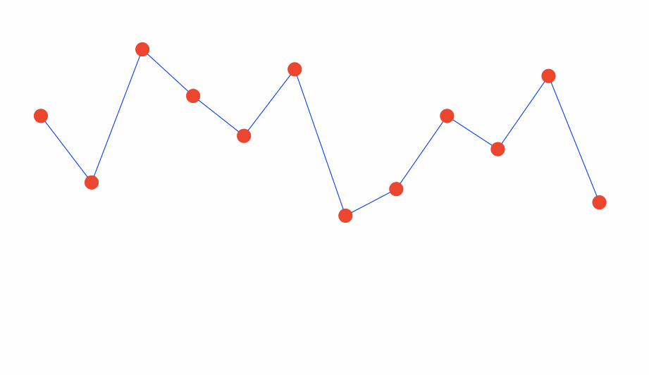
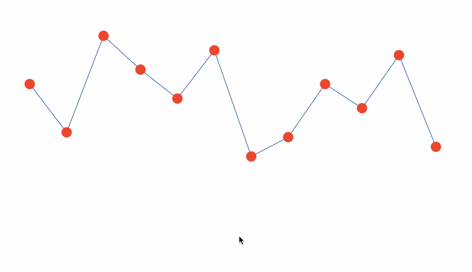

# Unit 16.3 - Line Charts, Scatterplots, and More with D3

## Overview

This lesson will advance student understanding of D3 to a higher level. They will learn to display multiple datasets on a single chart. Today's class will culminate in an activity charting the success of 1980s hair metal bands.

## Class Objectives

* Students will be able to create multiple axes and multiple charts with D3.
* Students will be able to create D3 transitions, tooltips, and event listeners in D3.
* Students will be able to gain a better understanding of reusable code and javascript functions.

- - -

# Activities Preview

* **Create a Multiline Chart with Multiple Axes**
* In this activity, students will create a multiline chart with multiple axes. Instead of styling the SVG paths and axes inline, as was the case in the last exercise, they will use CSS.

  * Files/Instructions:

    * [03-Evr_Readability/app.js](Activities/03-Evr_Readability/Solved/app.js)

    * [04-Stu_Multi_Lines_Axes/data.csv](Activities/04-Stu_Multi_Lines_Axes/Unsolved/data.csv)

    * [04-Stu_Multi_Lines_Axes/index.html](Activities/04-Stu_Multi_Lines_Axes/Unsolved/index.html)

    * [04-Stu_Multi_Lines_Axes/style.css](Activities/04-Stu_Multi_Lines_Axes/Unsolved/style.css)

    * [README.md](Activities/04-Stu_Multi_Lines_Axes/README.md)

      * Begin by inspecting the data provided to you in the CSV file.

      * Alter the code from the previous activity to plot a multi-line and multi-axes line plot of the data provided.

      * Use the styling provided in the CSS file to make the graph more readable.

    * Hints:

      * For reference on creating a date parser, see [D3 Documentation-Time Format](https://github.com/d3/d3-time-format#locale_format).

      * For reference on properly placing axis titles, see [MDN - Text Anchor](https://developer.mozilla.org/en-US/docs/Web/SVG/Attribute/text-anchor).

* **Adding Tooltips**
* In this activity, students will add tooltips to a pre-made chart.

  * Files/Instructions:

    * [07-Stu_Add_Tooltips/app.js](Activities/07-Stu_Add_Tooltips/Unsolved/app.js)

    * [07-Stu_Add_Tooltips/norway_medals.csv](Activities/07-Stu_Add_Tooltips/Unsolved/norway_medals.csv)

    * [07-Stu_Add_Tooltips/index.html](Activities/07-Stu_Add_Tooltips/Unsolved/index.html)

    * [07-Stu_Add_Tooltips/style.css](Activities/07-Stu_Add_Tooltips/Unsolved/style.css)

    * [README.md](Activities/07-Stu_Add_Tooltips/README.md)

      * Run a server and open the HTML file in the browser in order to study the chart.

      * Move onto the JavaScript file.  Take a moment to look through the code and explain it to a partner.

      * Write additional logic to render a tooltip for each data-point containing the date as well as the number of medals won.  A `dateFormatter` function has already been created.  Use it to format the datetime object when adding it to the tooltip.

    * Hints: Refer to the [d3-tip documentation](https://github.com/Caged/d3-tip) for for examples of creating tool-tips with the d3-tip library.

* **1980s Hair Metal Bands**
* Students now have all the tools to create this [hairbands.png](Images/hairbands.png) chart.

  * Files/Instructions:

    * [09-Stu_Hair_Metal/app.js](Activities/09-Stu_Hair_Metal/Unsolved/app.js)

    * [09-Stu_Hair_Metal/index.html](Activities/09-Stu_Hair_Metal/Unsolved/index.html)

    * [09-Stu_Hair_Metal/style.css](Activities/09-Stu_Hair_Metal/Unsolved/style.css)

    * [09-Stu_Hair_Metal/hairData.csv](Activities/09-Stu_Hair_Metal/Unsolved/hairData.csv)

    * [09-Stu_Hair_Metal/README.md](Activities/09-Stu_Hair_Metal/README.md)

      * Write code to complete the chart:

        1. Create scaling functions.

        2. Create axes functions and append them to the chart.

        3. Place data-bound circles on the chart.

        4. Add tooltips using the d3-tips library and tweak the CSS properties to your liking.

    * Hints:

      * See the [d3-tips documentation](https://github.com/Caged/d3-tip) for reference on using the library.

      * Although the code for labeling your x and y axis is provided, you can read a detailed explanation at the [d3noob Website - Adding Axis Labels to D3.js Graph](http://www.d3noob.org/2012/12/adding-axis-labels-to-d3js-graph.html).

* **Transitions**
* In this activity, students are challenged to create one of the two transitions on a chart:

  

  

  * Files/Instructions:

    * [11-Stu_Transitions/app.js](Activities/11-Stu_Transitions/Unsolved/app.js)

    * [11-Stu_Transitions/index.html](Activities/11-Stu_Transitions/Unsolved/index.html)

    * Although not essential, animations can liven up a chart. The D3 library radically simplifies the task of animating elements on a chart.

    * Take a few minutes to examine this [example using D3 transitions](https://bl.ocks.org/d3noob/899a0b2490318a96f9ebd40a5a84e4a7)

    * There are three elements of animated transitions in D3:

      1. The selection.

      2. The transition method.

      3. Attributes.

    * That is, in order to make a transition, we must first select element(s). We then use the `transition()` method to signal that a transition will take place, followed by specifying specific attributes of the transition, such as duration, movements, or color changes.

    * Now you will create at least one of the transitions shown by your instructor.

    * Bonus: Try adding a second transition to the chart!

    * Hints:

      * See [example using D3 transitions](https://bl.ocks.org/d3noob/899a0b2490318a96f9ebd40a5a84e4a7)

      * The first transition involves changing the original position of the circles so that they are off screen, and then transitioning them down to their proper locations after the rest of the chart is created.

      * The code for the second transition should be added to the `mouseout`, `click` and `mouseover`.

      * See the [D3 Docs on Transitions](https://github.com/d3/d3/blob/master/API.md#transitions-d3-transition) for reference.

* **Hair Metal Conclusion**
* Reading and understanding others' code is a big part of programming.  In this activity, students work in pairs to parse through code that allows a user to click on an x-axis label and see smooth, dynamic changes in the graph.

  * Files/Instructions:

    * [12-Par_Hair_Metal_Conclusion/app.js](Activities/12-Par_Hair_Metal_Conclusion/Unsolved/app.js)

    * [12-Par_Hair_Metal_Conclusion/hairData.csv](Activities/12-Par_Hair_Metal_Conclusion/Unsolved/hairData.csv)

    * [12-Par_Hair_Metal_Conclusion/index.html](Activities/12-Par_Hair_Metal_Conclusion/Unsolved/index.html)

    * [12-Par_Hair_Metal_Conclusion/style.css](Activities/12-Par_Hair_Metal_Conclusion/Unsolved/style.css)

    * [12-Par_Hair_Metal_Conclusion/README.md](Activities/12-Par_Hair_Metal_Conclusion/README.md)

    * Your task for the remainder of the class will be to pair up with a partner to discuss and dissect the code in `app.js`. Doing so will put you in a very good place to tackle the more difficult version of the homework assignment.

- - -

### Copyright

Trilogy Education Services © 2019. All Rights Reserved.
