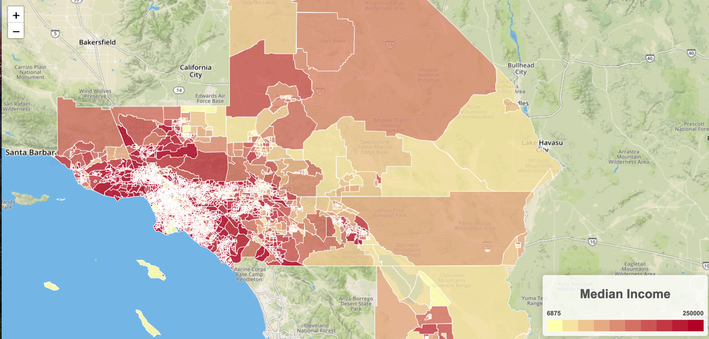

# Unit 17.2 - GeoJSON & Leaflet Plugins

## Overview

Today's class will be spent furthering our knowledge of GeoJSON and learning about the wonders of Leaflet plugins.

## Class Objectives

* Students will gain a firm grasp of mapping with GeoJSON.
* Students will learn about and practice using Leaflet plugins and third-party libraries.
* Students will learn how different maps can effectively visualize different datasets.

- - -

# Activities Preview

* **Rat Cluster**
* In this next activity, students will be flying solo. They will be taking data from NYC open data website ([NYC Open Data](https://data.cityofnewyork.us/)) and plotting it with the help of a Leaflet plugin. 

  * Files/Instructions:

    * [Unsolved](./Activities/03-Stu_MarkerClusters/Unsolved)

    * [README](./Activities/03-Stu_MarkerClusters/README.md)

* **Choropleth**
* In this activity, the class will be working together with their partners to create a choropleth map that will visualize the median household incomes of LA and surrounding counties.

  * Files/Instructions:

    
    (Median Income Choropleth)

    * Since we have yet to go over choropleth's as a class, this activity will take place over a series of "steps" and the class will rejoin after each step to review what they have done before moving on.

    * [Unsolved](./Activities/04-Par_MoneyChoropleth/Unsolved)

    * [README](./Activities/04-Par_MoneyChoropleth/README.md)

* **A Map of Your Very Own**
* Students will create a map of their very own from scratch. They will find a dataset, map it, then use a new plugin to visualize the data in an interesting way.

  * They will share their map with the class and give a VERY brief presentation on it at the end of the day.

  * The focus of this assignment is on getting a working map, however, so also let them know that the presentations are wholly secondary to making something cool.

- - -

## Copyright

Trilogy Education Services © 2019. All Rights Reserved.
