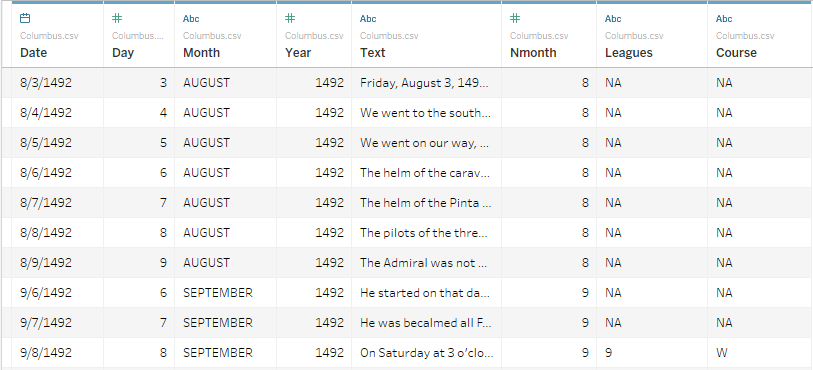

* **Exploration Data**
* For this activity, students will be given a dataset containing the logs from Christopher Columbus' voyage to find the "New World". They will have to load the dataset into Tableau and then search through its records to find specific entries.

  * File/Instructions:

    

    * [Columbus.csv](Activities/Extras/Resources/Columbus.csv)

    * Load the dataset provided into Tableau and create filters to collect the following...

    * All of the logs that were written in November.

    * The greatest recorded number of leagues traveled.

    * The records containing the word "shore" within them.

    * All of the records from the 16th of January, 1493 to the 15th of March, 1493.

    * Hints: When going through this activity, experiment with some of the filtering/sorting methods Tableau offers.