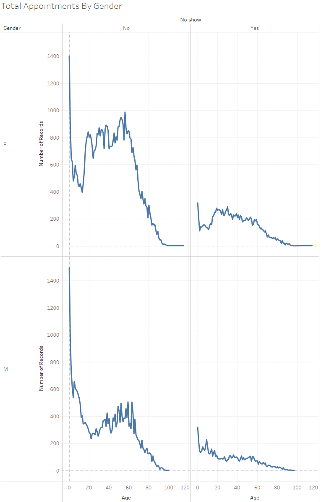

# Unit 20.1 - Time to Tableau Some Minds

## Overview

Today's lesson will introduce students to the powerful data visualization tool known as Tableau and many of its built-in functions.

- - -

## Class Objectives

* Students will be able to import various data sources, including CSV files and Excel spreadsheets, into Tableau.
* Students will be able to perform joins on multiple data sources.
* Students will be able to create basic visualizations in Tableau.
* Students will be able to customize their visualizations.
* Students will be able to create story boards in Tableau.

- - -

# Activities Preview

* **Explore Data**
* In this activity, students will be given visualizations, which they will attempt to recreate using Tableau.

  * Instructions: [Readme.pdf](Activities/03-Stu_Exploration/Unsolved/Readme.pdf)

* **No Shows**
* Students will now spend some time creating a series of visualizations that will answer some questions as to what kinds of people are more/less likely to show up to doctor's appointments.

  * File/Instructions:

    
        
    * [no_shows.csv](Activities/04-Stu_NoShow/Resources/no_shows.csv)

    * Create a line chart that compares the ages of patients against the total number of appointments. Then split this graph based upon gender and whether the patient showed up to their appointment. For this first step, you'll need to convert `Age` from a measure to a dimension.

    * Create a pair of bar charts that compare how many patients showed up to appointments versus how many were no-shows in different neighborhoods.

    * Create a stacked bar chart that compares no-shows to those who made it to appointment based upon the day of the week.

    * Create a pair of line graphs that compare age versus diabetes in both men and women.

    * Create a pair of line graphs that compare age versus alcoholism in both men and women.

    * Bonus:

      * Figure out how to create filters and manually exclude non-significant values from your charts using the `Filters` panel.

      * Now, using filters, modify your charts so that they are more visually understandable.

* **FIFA Analysis**
* Students will now create some tables based upon FIFA video game's player datasets. This will require them to merge multiple data sources together and then create visualizations off of the newly made dataset.

  * Files/Instructions:

    

    * [PlayerPersonalData.csv](Activities/06-Stu_FIFAPlayers/Resources/PlayerPersonalData.csv)

    * [PlayerAttributeData.csv](Activities/06-Stu_FIFAPlayers/Resources/PlayerAttributeData.csv)

    * [PlayerPlayingPositionData.csv](Activities/06-Stu_FIFAPlayers/Resources/PlayerPlayingPositionData.csv)

    * Create a join between each of the charts so that each player's data is matched up correctly.

    * Create a pair of charts that compare the potential of a club's players to their overall ability (`Overall` column). Then sort them from best to worst.

    * Create a chart that determines which soccer club is the most aggressive overall.

    * Create a chart that determines which nationality has the greatest acceleration on average, making sure to note how many players are from each nation in a second chart.

    * Create a chart that determines which nationality has the greatest long passing on average.

    * Create a chart that marks the potential of a player over time as they age.

* **The Ultimate Candy**
* Students will now take some time to create charts that compare candies against one-another. The charts themselves are quite basic but will be made more complex using marks.

  *  File/Instructions:

    

    * [candy-data.csv](Activities/07-Stu_UltimateCandy/Resources/candy-data.csv)

    * Create a pair of bar graphs that chart the win percent of each candy, then color the bars according to whether they are fruity and/or chocolatey.

    * Create a scatter plot comparing the sugar percentage against the win percentage. Color the points based upon whether they are chocolatey and size them according to price.

    * Create one more scatter plot comparing the sugar percentage against the win percentage. Color the points based upon whether they are fruity and size them according to price.

* **Degrees That Pay**
* The class will now build upon everything they have learned today in order to create a story in Tableau that visualizes what degrees/universities/regions pay out the best over time.

  * Files/Instructions:

    
  
    * [degrees-that-pay-back.csv](Activities/09-Stu_DegreesPay/Resources/degrees-that-pay-back.csv)

    * [salaries-by-college-type.csv](Activities/09-Stu_DegreesPay/Resources/salaries-by-college-type.csv)

    * [salaries-by-region.csv](Activities/09-Stu_DegreesPay/Resources/salaries-by-region.csv)

    * Create a story using the datasets provided and formulate graphs that might be used to explore the following hypotheses:

    * "Ivy League schools offer best salaries while state offer worst"

    * "Going to school in California/NE offers higher salaries"

    * "Higher starting salaries generally mean higher salaries mid-career"

    * Bonus: Create a chart that visualizes starting median salaries, by major, against mid-career median, 75th percentile, and 90th percentile salaries.

- - -

### Copyright

Trilogy Education Services © 2019. All Rights Reserved.
