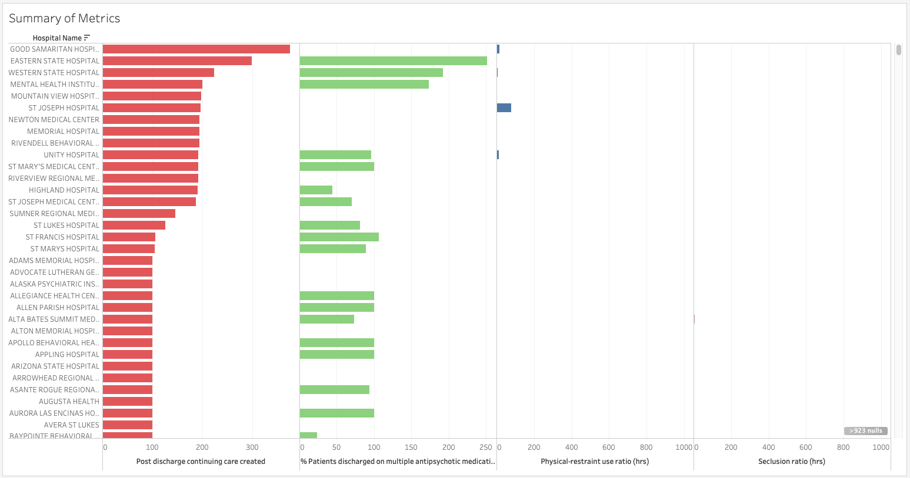

## Unit 20.3 - The Answer, My Friend, Is Tableauing in the Wind

## Class Objectives

* Students will perform exploratory data analysis using Tableau.
* Students will clean data prior to creating visualizations.
* Students will will create Tableau dashboards.

- - -

# Activities Preview

* **Psychiatric Health Care**
* In this warm-up activity, students will work with 2014 data on in-patient psychiatric patient care in hospitals across the United States.

  * Instructions:
  
    * [Activities/01-Stu_Healthcare/README.md](Activities/01-Stu_Healthcare/README.md)

    * The data set contains information on, among other things:

      * The number of patients who were discharged with a continuing care plan
      * The number of patients who were discharged with multiple anti-psychotic medications
      * The use of physical restraint
      * The use of seclusion

    * Students will first have to clean the data, at a minimum fixing the column headings. They will use the included **HBIPS_Measure_Sets.pdf** to accomplish this task.

      * For example, `HBIPS3` in the CSV refers to the use of seclusion, in hours.

    * Students should first come up with a dashboard summary that resembles the following.

      

    * Afterwards, they will create additional visualizations of their choosing. This activity will focus on data exploration, rather than obtaining pre-defined visualizations. Students are encouraged to come up with interesting and creative visualizations, and they are free to bring additional data sources into the workbook.

* **Airline Safety**
* In this activity, students will explore the safety of the world's airlines. The data set used here is from [fivethirtyeight.com](https://github.com/fivethirtyeight/data/tree/master/airline-safety)

  * Instructions:
  
    * [Activities/02-Stu_Airline/README.md](Activities/02-Stu_Airline/README.md)

    * It will be an open-ended exploration of the data, but some questions to consider might be:

      * What are the safest airlines in the world, and how do we define the idea of safety?
      * Can we group airlines by region to determine whether some regions have better track records than others? What are some possible fallacies of this approach?

* **Endangered Languages**
* In this activity, students will be required to visualize data on the world's endangered languages. In addition, they will join additional data to their data set to create extra visualizations.

  * Instructions:
  
    * [Activities/03-Stu_Languages/readme.md](Activities/03-Stu_Languages/README.md)

* **Mini Project**

  * In this open-ended activity, students will use their Tableau skills to explore data and create visualizations.

  * Students will work in pairs or groups of three.

  * They must use at least two data sources.

  * They may use their previous group projects for inspiration. However, they should not simply replicate their old projects in Tableau.

  * When working with data, they may need to clean it with a tool like Pandas before bringing it into Tableau.

  * They will give a brief (3-5 minutes) presentation to the class with a summary of their visualizations and findings.

* **Presentations**
* Groups will deliver a brief presentation of their findings.

- - -

### Copyright

Trilogy Education Services © 2019. All Rights Reserved.
