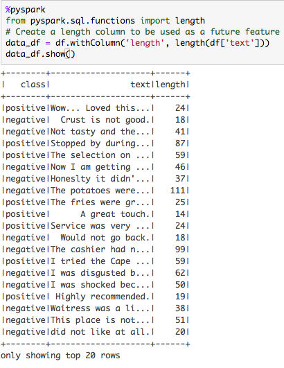
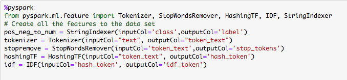
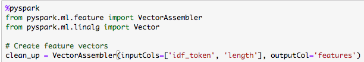
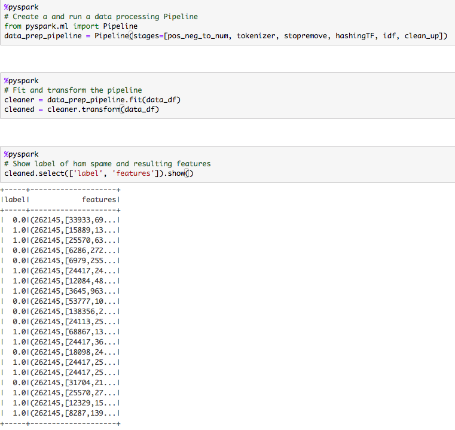
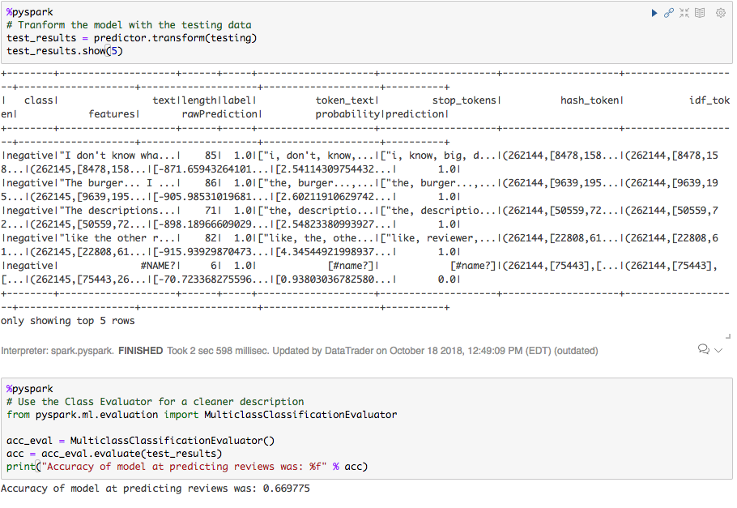

# Unit 22.2 - Big Data in the Cloud

## Overview

Today's class will continue to build on PySpark DataFrames using Google Colab. The goal today is to demonstrate how natural language processing (NLP) works by creating a big data processing pipeline that is used to train a Naive Bayes spam detector.

## Class Objectives

By the end of today's class, students will be able to:

* Explain why NLP is necessary for a big data tool kit.
* Apply transformations resulting from NLP data processing to PySpark DataFrames.
* Explain and utilize PySpark text-processing methods like tokenization, stop words, n-grams, and term and document frequency.
* Describe example steps in an NLP data processing pipeline.

- - -

# Activities Preview

* **PySpark NLP Tokens**
* In this activity, students will create NLP tokens using PySpark.

  * Files/Instructions::
  
    * [tokenizing_data.ipynb](Activities/03-Stu_Pyspark_NLP_Tokens/Unsolved/tokenizing_data.ipynb)

    * [data.csv](Activities/03-Stu_Pyspark_NLP_Tokens/Resources/data.csv)

    * [README.md](Activities/03-Stu_Pyspark_NLP_Tokens/README.md)

* **Food Review Stop Words**
* In this activity, students will remove stop words from a food review dataset using PySpark.

  * Files/Instructions::

    * [nlp_stopwords.ipynb](Activities/05-Stu_Pyspark_NLP_Stopwords/Unsolved/nlp_stopwords.ipynb)

    * [food_reviews.csv](Activities/05-Stu_Pyspark_NLP_Stopwords/Resources/food_reviews.csv)

    * [README.md](Activities/05-Stu_Pyspark_NLP_Stopwords/README.md)

* **PySpark NLP TD–IDF with HashingTF**
* In this activity, students will apply what they have learned so far to hash values from an airline dataset using PySpark.

  * Files/Instructions:

    * [airline_hashing.ipynb](Activities/07-Stu_Pyspark_NLP_HashingTF/Unsolved/airline_hashing.ipynb)

    * [airlines.csv](Activities/07-Stu_Pyspark_NLP_HashingTF/Resources/airlines.csv)

    * [README.md](Activities/07-Stu_Pyspark_NLP_HashingTF/README.md)

* **Classifying Yelp Reviews**
* This activity uses a Naive Bayes classifier and NLP data processing pipeline to classify reviews from Yelp as either positive or negative.

  * Files/Instructions:

    * [naive_review.ipynb](Activities/08-Evr_Naive_Bayes_Reviews/Unsolved/naive_review.ipynb)

    * [yelp_reviews.csv](Activities/08-Evr_Naive_Bayes_Reviews/Resources/yelp_reviews.csv)

    * Read in the file containing Yelp reviews.

    * Create a column that adds the length of the review as a feature.

      

    * Create a list of transformations to be applied in the pipeline.

      

    * Create a feature vector containing the output from the IDFModel (the last stage in the pipeline) and the length.

      

    * Set up the pipeline and fit it to the data.

      

    * Create training and testing data.

    * Create and fit the Naive Bayes model to the training data.

    * Predict outcomes using the testing set.

    * Use `MulticlassClassificationEvaluator` to evaluate the model on the testing set.

      

- - -

## Copyright

© 2019 Trilogy Education Services
